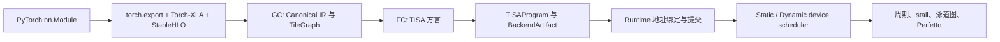

# NPU OOO Simulator

## 整体流程



项目用于研究 TISA 风格 NPU 的编译、运行时和乱序调度。生产入口是一条线性的真实
PyTorch 路径：

```text
PyTorch nn.Module
  -> torch.export.ExportedProgram
  -> Torch-XLA StableHLO
  -> 官方 StableHLO parse/verify
  -> Graph Compiler (GC)
  -> Canonical OperatorGraph / Semantic TileGraph
  -> Fusion Compiler (FC)
  -> TISA 方言
  -> TISAProgram
  -> BackendArtifact
  -> RuntimeSubmission
  -> TISA device scheduler
  -> 周期、泳道图和 Perfetto trace
```

新增 workload 时提供真实的 `torch.nn.Module` 和 example inputs。Torch-XLA 负责
ATen 到 StableHLO 的转换，项目维护 StableHLO semantic family 到 Canonical、TISA
和 backend capability 的映射。

## 当前能力

- `torch.export` 捕获真实 PyTorch module，并保存源图 provenance；
- Torch-XLA 生成 StableHLO，OpenXLA 官方 bindings 完成 MLIR parse/verify；
- GC 完成 canonicalization、复合语义恢复、tile 切分、region/state 依赖和 locality
  metadata；
- FC 输出带有 operand、TileMem、UnitMap、typed dependency 和 payload recipe 的
  TISA 方言；TISA Generator 生成 scheduler 消费的 `TISAProgram`；
- `AnalyticalCodegenBackend` 生成 `BackendArtifact`，backend、timing provider 和
  event backend 均可替换；
- static 和 dynamic device policy 共享同一份编译产物、地址绑定和 timing source；
- runtime 负责物理地址、command chunk、descriptor arrival 和同步；device scheduler
  负责 queue、ROB、依赖、资源和 OOO issue；
- 支持 Matmul、batched Matmul、GEMV、elementwise、reduce、Softmax、LayerNorm、
  RMSNorm、Attention region、SwiGLU、RoPE、Conv2D、BatchNorm inference、pooling、
  reshape/transpose、固定窗口 KV-cache；
- `RuntimeStateRegistry` 和 `RuntimeSequence` 支持固定窗口 decode 的多次 invocation；
- symbolic shape 使用 normalized shape environment 完成 Canonical resolve 与 specialization；
- 输出分阶段 artifact、周期与 stall 统计、SVG/PNG 泳道图和 Perfetto JSON；
- 支持 analytical、timing table、systolic MXU profile 以及 RTL completion trace
  importer。

默认 timing source 是 analytical event model。加载 RTL-observed profile 后，manifest
会记录相应 calibration status；两类结果分别用于趋势研究和校准时序分析。

## 环境

正式前端使用同一个 Python 环境中的：

```text
Python 3.12
torch 2.9.1
torch-xla 2.9.0
OpenXLA StableHLO wheel 1.12.1
```

本机验证解释器为 `/usr/bin/python3.12`，安装细节见
[docs/install-stablehlo.md](docs/install-stablehlo.md)。

## 快速运行

编译并动态调度一个真实的两头 Attention block：

```bash
cd /home/lora/OpenTPU/npu-ooo-simulator

PYTHONPATH=src /usr/bin/python3.12 -m npu_ooo.cli compile-model \
  --torch-module examples.torch_models:MultiHeadAttentionBlock \
  --input-shape 1,4,8 --input-shape 1,1,4,4 \
  --tile-size 4 \
  --policy dynamic_ready_queue \
  --output-dir out/attention-dynamic
```

比较 static 与 dynamic 时固定 module、shape、tile planner、MachineConfig、backend 和
timing provider，实验变量设为 `--policy` 与输出目录：

```bash
PYTHONPATH=src /usr/bin/python3.12 -m npu_ooo.cli compile-model \
  --torch-module examples.torch_models:MultiHeadAttentionBlock \
  --input-shape 1,4,8 --input-shape 1,1,4,4 \
  --tile-size 4 --policy static_pipeline \
  --output-dir out/attention-static
```

`--runtime-device-matrix` 在一次编译后运行 runtime/device 四种组合，保证所有策略行
共享 `artifact_id`、`program_id` 和 buffer binding。

真实 pre-norm decoder block：

```bash
PYTHONPATH=src /usr/bin/python3.12 -m npu_ooo.cli compile-model \
  --torch-module examples.torch_models:PreNormDecoderBlock \
  --input-shape 1,4,8 --input-shape 1,1,4,4 \
  --tile-size 4 --policy dynamic_ready_queue \
  --output-dir out/decoder-dynamic
```

论文 benchmark 的 scaled case 使用：

```bash
PYTHONPATH=src /usr/bin/python3.12 -m npu_ooo.cli paper-matrix \
  --benchmarks all --variant micro --arch minimal \
  --tile-size 4 --output-dir out/paper-matrix
```

registry 当前包含：`resnet50`、`bert-base`、`gpt-j-6b-oneblk`、`llama2-13b-oneblk`、
`deepseek-r1-16b-prefill`、`deepseek-r1-16b-decode`。这些 case 以真实 PyTorch block
构成 scaled micro 或 representative proxy，用于比较编译语义和调度趋势。`micro`
提供小尺寸确定性输入；`paper_shape` 使用接近论文的形状并记录更高的资源需求。

`paper-matrix` 的目录结构：

```text
out/paper-matrix/
├── README.md
├── matrix_index.json
├── sweep.csv
├── sweep.json
└── <case-id>/<variant>/
    ├── 00_frontend/ ... 04_backend/   # 共享编译产物
    ├── artifact_index.json
    ├── manifest.json
    ├── summary.json
    └── policy_matrix/
        └── runtime-<r>__device-<d>/
            ├── 05_runtime/
            ├── 06_simulation/
            └── 07_trace/
```

矩阵根目录保存 case 清单和跨 case 汇总；每个 case 保存一份共享编译产物；策略目录
保存 runtime、simulation 和 trace。实验开始前使用新的输出目录，并以
`matrix_index.json` 作为本次结果清单。

## 添加 PyTorch 算子或模型

在可导入模块中定义真实的 `torch.nn.Module`：

```python
import torch

class MyOperator(torch.nn.Module):
    def forward(self, lhs, rhs):
        return torch.matmul(lhs, rhs)
```

运行编译：

```bash
PYTHONPATH=src:/path/to/module /usr/bin/python3.12 -m npu_ooo.cli compile-model \
  --torch-module my_module:MyOperator \
  --input-shape 32,64 --input-shape 64,128 \
  --output-dir out/my-operator
```

每个 `--input-shape` 对应一个 positional tensor input。CLI 生成确定性 example input，
用于 `torch.export` 的 shape/dtype 捕获。

新增 StableHLO operation 时按以下链路注册能力：

```text
StableHLO semantic capability
  -> Canonical op mapping 或 composite recovery pass
  -> TISA stage definition
  -> backend lowering capability
  -> PyTorch 端到端回归
```

编译边界对 registry 外的 operation 产生明确诊断，诊断包含原始名称、缺失的 capability
和当前已知集合。semantic fusion pattern 依据 shape、常量和数据流证明结果工作，模型名
归属于 provenance 与 benchmark registry。

GC 使用 `--tile-size` 生成确定性 baseline；`--tile-size-candidates 2,4,8` 启用
`cost-model-v1`，按 tile 数、估算计算周期、root traffic 和 local working-set 选择
候选，并把评分写入 `01_gc/schedule.json`。

## 输出目录

```text
out/<run>/
├── manifest.json
├── artifact_index.json
├── 00_frontend/
│   ├── source_frontend_import.json
│   ├── generated.mlir
│   ├── stablehlo_module.json
│   └── frontend_import.json
├── 01_gc/
│   ├── canonical_graph.json
│   ├── gc_artifact.json
│   ├── pass_dumps/
│   ├── schedule.json
│   ├── compile_statistics.json
│   ├── tile_graph.{json,dot}
│   └── operator_graph.{dot,svg}
├── 02_fc/
│   ├── tisa_dialect.json
│   └── fc_diagnostics.json
├── 03_tisa/
│   ├── tisa_program.json
│   └── compiled_artifact.json
├── 04_backend/
│   ├── backend_artifact.json
│   ├── execution_graph.{json,dot}
│   └── machine.json
├── 05_runtime/
│   ├── runtime_submission.json
│   └── address_dependencies.json
├── 06_simulation/
│   ├── summary.json
│   ├── tasks.csv
│   └── tisa_instructions.csv
└── 07_trace/
    ├── swimlane.{svg,png}
    └── perfetto.json
```

`generated.mlir` 展示 Torch-XLA 输出；`01_gc/pass_dumps/` 展示每个 GC pass 的输入、
输出和诊断；`02_fc/tisa_dialect.json` 展示 FC 语义 op；`03_tisa/tisa_program.json`
是 device scheduler 输入；`04_backend/backend_artifact.json` 展示每条 TISA instruction
的 backend payload。复合算子的内部 primitive 保留在 payload 和 lane trace 中。

Softmax 默认使用 materialized row-wise payload。`--softmax-algorithm online` 选择
分析版 online state-chain：相邻 reduction tile 传递 `(max, sum)` 状态，TISA 语义边界
保持同一语义边界。该模式用于观察状态依赖对调度周期的影响；完整 rescale、最终归一化和
workspace 生命周期属于后续数值 backend 扩展。

## 调度边界

```text
编译期 SchedulePlanner：tile size、loop order、residency intent
runtime：物理地址、command chunk、descriptor arrival、同步
device scheduler：依赖、ROB、queue、资源状态与 TISA issue
backend：ExecutionTask 时序、completion event、泳道图
```

`static_pipeline` 按 program order 与依赖 issue；`dynamic_ready_queue` 在到达、依赖
满足且资源可用的窗口内选择 ready TISA instruction。两种 policy 复用同一份编译产物。

## Backend 与 RTL 校准

```text
CodegenBackend: analytical
EventBackend: analytical_event
TimingProvider: analytical | timing_table | systolic_mxu_profile
```

RTL completion trace 的 JSON/CSV schema、VCS console log 转换和 interval 选择见
[docs/rtl-calibration.md](docs/rtl-calibration.md)。`compute_start_to_compute_done`
对应 isolated matmul primitive；`descriptor_issue_to_done` 对应 full descriptor interval，
manifest 会保留该区间标签。

## 代码导航

```text
src/npu_ooo/cli.py                       用户入口和实验输出
src/npu_ooo/compiler/pipeline.py         PyTorch-to-TISA 主流程
src/npu_ooo/frontend/bridge.py           torch.export 捕获与 provenance
src/npu_ooo/frontend/torch_xla_export.py Torch-XLA StableHLO 导出
src/npu_ooo/frontend/stablehlo_official.py 官方 verifier 与导入边界
src/npu_ooo/compiler/graph_compiler.py   论文 GC：图优化、切 tile、依赖
src/npu_ooo/compiler/fusion_patterns.py  semantic recovery/fusion registry
src/npu_ooo/compiler/fusion_compiler.py  论文 FC：TileGraph 到 TISA 方言
src/npu_ooo/compiler/tisa_generator.py   TISA 方言到 TISAProgram
src/npu_ooo/compiler/tisa_dialect.py     TISA stage、metadata 和 payload recipe
src/npu_ooo/backend/                     可替换 backend 与 timing provider
src/npu_ooo/simulator/tisa.py            TISA device scheduler simulator
```

完整分层说明见 [docs/architecture.md](docs/architecture.md)，论文语义映射见
[docs/tisa-alignment.md](docs/tisa-alignment.md)。

## 验证

```bash
PYTHONPATH=src /usr/bin/python3.12 -m unittest discover -s tests -v
PYTHONPATH=src /usr/bin/python3.12 -m compileall -q src tests examples
git diff --check
```

端到端测试调用 PyTorch、Torch-XLA 和官方 StableHLO；后端与 scheduler 单元测试在
所属 IR 层验证接口契约。
