# NPU OOO Simulator

用于研究 TISA 风格 NPU 的编译、目标存储映射和乱序调度。输入真实 PyTorch 模型，
输出分阶段编译产物、周期与 stall 统计、泳道图和 Perfetto trace。

最常见的使用方式是：**编译一次 → 固定编译包比较 static/dynamic → 查看周期和阻塞原因**。
当前结果主要来自可配置的分析模型；加载执行单元的 RTL timing 不代表整个 scheduler 已完成硬件校准。

## 整体架构

先从全流程理解各阶段的位置：编译器决定算子如何切成 tile、放在哪些存储中以及如何搬运；
Runtime 绑定本次调用的地址并提交 descriptor；设备 scheduler 决定何时发射，
execution backend 执行并反馈完成。

```mermaid
flowchart LR
    A[Workload: PyTorch module + static args/kwargs] --> B[torch.export + Torch-XLA + StableHLO]
    B --> C[GC: Canonical IR 与 TileGraph]
    C --> D[FC: 符号 TISA 方言]
    D --> E[TISA Generator: 虚拟 TISA]
    E --> I[Target Lowering: TargetPlan]
    I --> J[最终 TISA、BackendArtifact 与 MemoryPlan]
    J --> F[Runtime Loader: 地址绑定与 descriptor envelope]
    F --> G[LoadedDeviceProgram: 已绑定的设备描述符]
    G --> K[Static / Dynamic device scheduler]
    K -->|issue| L[Execution backend]
    J -.->|加载 payload| L
    L -->|completion feedback| K
    K --> H[周期、stall、泳道图、Perfetto]
    L --> H
```



其中，FC 保留抽象 scope/role，Target Lowering 才根据机器配置选择具体 memory、route 和 EU。
最终 TISA 是编译产物，绑定后的 `LoadedDeviceProgram` 才是本次调用的设备输入。
`DeviceSimulator` 负责推进时间并连接 scheduler 与 execution backend；复合 TISA 的内部
primitive 由 execution backend 执行，不独立进入全局乱序窗口。

快速导航：[运行指南](#运行指南) · [参数配置](#参数配置) · [查看结果](#查看结果) ·
[常见问题](#常见问题) · [更多实验](#更多实验) · [架构与开发](#架构与开发)

## 运行指南

### 1. 准备环境

以下命令均在仓库根目录执行，使用 `PYTHONPATH=src`，无需先安装本项目：

```bash
cd /home/jiangcx/LPU/npu-ooo-simulator
PYTHONPATH=src python3.12 -m npu_ooo.cli --help
```

如果仓库位于其他机器，请替换 `cd` 路径；如果使用虚拟环境，请将 `python3.12` 换成对应解释器。

| 运行内容 | 环境要求 |
| --- | --- |
| `compile`、`compile-and-sim`、`paper-matrix` | 完整前端环境：PyTorch、Torch-XLA、官方 StableHLO bindings 必须安装在同一个 Python 环境中 |
| `simulate` | 已有兼容编译包；不需要安装或导入 PyTorch、Torch-XLA、StableHLO 前端 |

项目记录的完整前端验证组合为 Python 3.12、torch 2.9.1、torch-xla 2.9.0、
StableHLO wheel 1.12.1。安装和 parse/verify 检查见 [环境安装指南](docs/install-stablehlo.md)。
仅能运行 `--help` 不代表完整前端依赖已经可用。

### 2. 用 JSON 编译多输入模型

多输入、混合 dtype 或需要构造参数的模型，优先使用
[workload JSON](docs/workload-config.md)。下面的配置同时声明四个 Attention 输入、固定
shape、初始化方式、编译参数和已有的仿真参数：

```bash
PYTHONPATH=src python3.12 -m npu_ooo.cli compile-and-sim \
  --config configs/workloads/attention.json \
  --output-dir out/quickstart-attention
```

- `model.kwargs` 是构造模型时传给类/工厂的参数；`inputs.args/kwargs` 是传给
  `forward` 的静态示例输入，二者不是一回事。
- `model.dtype` 只转换浮点参数和 buffer；每个 tensor 输入的 `dtype` 独立声明，token
  ID 应使用整数和 `randint`，不能用统一 `randn` 代替。
- `seed` 在模型构造和输入生成前设置；最终解析结果、输入结构及初始化 provenance 写入
  `00_frontend/resolved_workload_config.json`、`workload.json` 和 `input_signature.json`。
- `runtime-policy static` 固定 host 提交流；`policy dynamic_ready_queue` 允许设备在到达的指令中乱序选择，两者不矛盾。

所有 extent 都是编译时常量。修改 `sequence_length`、`kvlen`、cache window 或其他实际
计算 shape 后必须重新 `compile`；runtime 的 dynamic index/layout binding 不会改变计算量。

运行后先打开：

```text
out/quickstart-attention/06_simulation/summary.json    # 周期、stall、资源统计
out/quickstart-attention/07_trace/swimlane.svg         # 执行泳道图
out/quickstart-attention/06_simulation/tisa_instructions.csv  # 指令生命周期
```

建议每次实验使用新的输出目录，不要覆盖需要保留的结果。

### 3. 编译一次，比较 static 与 dynamic

正式对照实验优先使用分离流程，避免每个策略重新编译。

**先编译：**

```bash
PYTHONPATH=src python3.12 -m npu_ooo.cli compile \
  --config configs/workloads/attention.json \
  --output-dir out/attention-compile
```

**再用同一编译包运行两种设备策略：**

```bash
for policy in static_pipeline dynamic_ready_queue; do
  PYTHONPATH=src python3.12 -m npu_ooo.cli simulate \
    --compile-dir out/attention-compile \
    --event-backend cycle_event \
    --scheduler-config configs/scheduler/cycle_baseline.json \
    --runtime-policy static --policy "$policy" \
    --dynamic-priority oldest_first --address-scoreboard \
    --output-dir "out/attention-$policy"
done
```

`simulate` 默认读取编译包内的 `04_backend/machine.json`，无需再写 `--arch`。
两次运行只改变设备 policy；输入、编译包、runtime 提交配置、硬件和 timing source 均相同。
对照 `compile_package_sha256`、周期和 stall，而不是只看泳道图是否更紧凑。

`static_pipeline` 是项目的固定提交顺序、允许跨 EU 重叠的静态计划基线，
不等同于论文作者未公开的强静态排程器。小图中 static/dynamic 周期相同是正常结果。

### 4. 选择合适的入口

| 命令 | 做什么 | 何时使用 |
| --- | --- | --- |
| `compile` | 前端、GC/FC、TISA、target lowering、payload 和 MemoryPlan | 改模型、shape、tile、存储映射时 |
| `simulate --compile-dir …` | 加载编译包，重新绑定 runtime 并仿真 | 比较策略、队列、控制延迟、timing 时 |
| `compile-and-sim` | 串联上述两个阶段 | 首次跑通或单次实验 |
| `paper-matrix` | 按 benchmark registry 批量编译、比较设备策略 | 模型 proxy、策略矩阵和请求重放 |

`compile` 不接受 device policy、runtime、event/timing 参数。
`--runtime-config` 仅属于 `simulate`；各入口完整参数以子命令帮助为准：

```bash
PYTHONPATH=src python3.12 -m npu_ooo.cli compile --help
PYTHONPATH=src python3.12 -m npu_ooo.cli simulate --help
PYTHONPATH=src python3.12 -m npu_ooo.cli paper-matrix --help
```

## 参数配置

先分清参数在哪个阶段生效。下面的默认值指 CLI 默认，不代表某台真实芯片的参数。
时间单位均为 **cycles**，容量和带宽字段带 `bytes` 时按字节计。

### 1. 编译参数：修改后需要重新 compile

适用于 `compile`、`compile-and-sim`；`paper-matrix` 的模型输入由 registry 提供。

| 参数 | 默认值 / 可选值 | 含义与使用提示 |
| --- | --- | --- |
| `--config` | 不指定 | 通用 schema-v1 workload JSON；支持构造参数、args/kwargs、混合 dtype、初始化和已有 compile/runtime 选项 |
| `--torch-module` | 与 `--input-shape` 配套的简写 | 可导入的无参数 `nn.Module` 类或工厂；不能和 `--config` 的 workload 同时使用 |
| `--input-shape` | 简写模式必填，可重复 | 为每个 positional 输入生成 `randn`，顺序与 `forward` 一致；复杂输入应改用 JSON |
| `--input-dtype` | 简写模式默认 `float32` | 同时作为模型浮点参数和所有 `randn` 输入 dtype；JSON 模式中二者独立 |
| `--model-id` | 默认来自类/工厂名 | 实验标识，不选择另一套模型实现 |
| `--tile-size` | `32` | GC 的基线 tile 尺度；不同算子按自身维度解释，边界 tile 可更小 |
| `--tile-size-candidates` | 不启用；如 `2,4,8` | 启用 GC cost model 选择候选，评分见 `01_gc/schedule.json`；不是自动输出所有候选的 sweep |
| `--arch` | `minimal`；另有 `wide-mxu`、`lpu-like` | 选择内置机器；具体映射见下文 |
| `--machine-config` | 不指定 | 读取完整 MachineConfig JSON，优先于 `--arch`，不是局部补丁 |
| `--codegen-backend` | `analytical` | 生成 target payload 的后端；与仿真的 event/timing 选项不同 |
| `--softmax-algorithm` | 不覆盖模型设置；普通默认为 `materialized` | `materialized` 为行级实现；`online` 为分析版 `(max,sum)` state chain，不代表完整在线 Softmax 数值实现 |
| `--onchip-handoff` | `root_memory` | `attention_single_consumer` 尝试合法的 Matmul→Softmax 片上交接；受 role、layout、dtype、tile、容量、fan-out 和可达性限制，不满足时记录回退原因 |

片上交接开关会改变搬运和编译产物。研究其收益时分别编译 root/onchip 两个版本，
再在每个版本内部比较 static/dynamic，不要将减少访存的收益全部归因于乱序调度。

配置优先级为：显式 CLI 编译/仿真选项 > JSON 对应字段 > 项目默认值。JSON 内的
`model+inputs` 和 `workload` 两种构造方式互斥；旧 `--torch-module/--input-shape` 也是一套
独立简写输入源，不能与 `--config` 混用。完整 schema 和全部可运行样例见
[通用 workload 配置](docs/workload-config.md)。

`configs/workloads/` 还覆盖 ResNet-50、GPT-J、LLaMA prefill、DeepSeek dense/MoE
prefill/decode，并用文件名区分 one-block、两层 model proxy 和固定窗口 decode；这些配置
可以脱离 `paper-matrix` 单独 `compile`，但不会因此被解释成论文完整尺寸模型。

### 2. 设备调度：先选模型，再选策略

适用于 `simulate`、`compile-and-sim`。`paper-matrix` 用 `--device-policies` 指定策略列表。

这里 EU 指执行单元，WQ 是等待队列，IQ 是发射队列；payload 是一条 TISA 绑定的内部执行实现。

| 参数 | 默认值 / 可选值 | 含义 |
| --- | --- | --- |
| `--event-backend` | `analytical_event` / `cycle_event` | 默认事件模型用于分析基线；逐周期模型用于 WQ/IQ、控制流水、反馈和退休反压研究。它不是执行延迟表的选择开关 |
| `--policy` | `static_pipeline`（默认） | 固定本次提交顺序的静态计划，允许跨 EU 重叠 |
| 同上 | `dynamic_ready_queue` | 从已到达、依赖满足且资源可用的窗口内选择指令 |
| 同上 | `sequential` | 串行参考策略，限制指令间重叠 |
| `--dynamic-priority` | `oldest_first`（默认） | 动态策略优先选择较老候选 |
| 同上 | `compiler_hint` | 使用 descriptor 显式携带的优先级 hint |
| 同上 | `oracle_critical_path` | 使用完整程序的参考策略；旧名 `critical_path` 是兼容别名，不是硬件在线策略 |
| `--address-scoreboard` | 关闭 | 开启额外地址冲突检查；cycle 设备模型检查已接收的较老未完成 descriptor，runtime loader 另负责将绑定后的 alias 转为显式依赖 |
| `--memory-bank-scoreboard` | 关闭 | 按 MachineConfig 的 bank/读写端口建模结构冲突；当前为 payload 占用期间的保守模型，不是逐 transaction DRAM 仿真 |
| `--scheduler-config` | 不指定 | 读取控制流水 JSON，**必须同时选择 `cycle_event`**；格式见下一节 |

CLI 默认是 **static + analytical_event**，不是 dynamic + cycle_event；需要后者时必须显式指定。

### 3. 队列容量与逐周期控制参数

命令行容量覆盖以下默认值；未提供时沿用所选机器配置。

| CLI 参数 | 默认来源 | `cycle_event` 中的含义 |
| --- | --- | --- |
| `--instruction-queue-depth` | `machine.scheduler.instruction_queue_depth` | Reception FIFO 的 TISA 指令容量 |
| `--rob-entries` | `machine.scheduler.rob_entries` | ROB 指令容量；dispatch 分配，按顺序 retire 释放，不模拟 CPU 推测回滚 |
| `--max-inflight-tiles` | `machine.scheduler.max_inflight_tiles` | 同时活动的 tile 数，不是 TISA 条数；一个 tile 可以有多条 transfer/compute 指令 |
| `--dependency-window` | `machine.scheduler.dependency_window` | 每个 WQ 的候选扫描窗口，不是整个程序长度 |
| `--ready-queue-depth` | 最终生效的 `instruction_queue_depth` | 每类 EU 的 IQ 上限之一；实际容量为它与 `pipeline.iq_entries` 的较小值 |

**WQ 容量不由 `--dependency-window` 设置**：每类 EU 的 WQ 容量为
`execution_units[].queue_depth × count`，需要在 MachineConfig 中配置。

控制流水模板：[configs/scheduler/cycle_baseline.json](configs/scheduler/cycle_baseline.json)。
文件顶层直接放以下字段，不要再包一层 `pipeline`：

| JSON 字段 | 默认值 | 单位与含义 |
| --- | ---: | --- |
| `receive_width` | 1 | 每周期最多接收的指令数 |
| `dispatch_width` | 1 | 每周期最多从 Reception 分派到 WQ 的指令数 |
| `select_width` | 1 | 每周期最多从 WQ 选入 IQ 的指令数 |
| `issue_width` | 1 | 全局每周期最多发射数，还受各 EU 的 `issue_width` 和接收能力限制 |
| `completion_width` | 1 | 每周期最多接受的完整完成反馈数，不是物理 EU 数量 |
| `retire_width` | 1 | 每周期最多退休的指令数 |
| `dispatch_latency` | 1 | dispatch 后进入依赖就绪判断的最小延迟 |
| `select_latency` | 1 | select 到最早 issue 的延迟 |
| `wakeup_latency` | 1 | 依赖反馈到消费者可就绪的延迟 |
| `completion_latency` | 0 | 物理执行结束到最早接受完整反馈的延迟 |
| `retire_latency` | 1 | complete 到最早 retire 的延迟 |
| `iq_entries` | 8 | 每类 EU 的 IQ 容量，与 `ready_queue_depth` 共同限制 |
| `inflight_entries` | 16 | 每类 EU 的语义表 Fu 容量，**按 operand 条目数计，不按指令数计** |
| `max_cycles` | 1000000 | 运行周期上限，用于诊断长期无法完成的仿真 |

字段均为整数；除 `wakeup_latency`、`completion_latency` 可以为 0 外，其余至少为 1。
示例：将下列内容保存为 `cycle-tuned.json`，然后传入 `--scheduler-config cycle-tuned.json`：

```json
{
  "issue_width": 2,
  "completion_width": 2,
  "wakeup_latency": 2,
  "iq_entries": 16
}
```

配置优先级：命令行容量覆盖 MachineConfig 对应容量；`--scheduler-config` 替换所选机器的
整组 `scheduler.pipeline`。该文件省略的字段取上表默认值，**不是继承机器中同名字段**。
没有传文件时才完整使用 `machine.scheduler.pipeline`。

物理执行结束、反馈接受、依赖唤醒和退休是不同事件。逐周期顺序与手算示例见
[Device scheduler 周期模型](docs/device-scheduler.md)。

### 4. 硬件与执行时间：三个 JSON 不要混用

| 配置选项 | 配置内容 | 示例/来源 |
| --- | --- | --- |
| `--machine-config` | memory 层级/容量/bank/端口、EU、合法 transfer path、operand placement、scheduler 默认值 | 编译输出 `04_backend/machine.json` 是完整模板；内置定义见 [arch/machine.py](src/npu_ooo/arch/machine.py) |
| `--scheduler-config` | 上节列出的周期控制字段 | [cycle_baseline.json](configs/scheduler/cycle_baseline.json) |
| `--timing-config` | payload 内部任务的执行时长/发射间隔或 MXU profile | [attention_probe.json](configs/timing/attention_probe.json) |

内置机器的区别：

| `--arch` | 用途和主要存储映射 |
| --- | --- |
| `minimal` | 简单研究基线；DRAM/SRAM/RF，Matmul 输入输出在 SRAM |
| `wide-mxu` | 与 minimal 具有兼容存储拓扑；增加 MXU 实例数和发射能力 |
| `lpu-like` | LPU 风格研究配置；GM/UB/LMB/RMB/PSB/ARB，Matmul 使用 LMB/RMB/PSB，路径由目标映射生成；不是已校准真实硬件 |

`simulate` 的机器选择优先级：`--machine-config` > 显式 `--arch` > 编译包的机器。
切换到不兼容的存储拓扑、engine、alignment、operand placement 或操作能力时必须重新编译。
兼容的容量、带宽、延迟和 EU 数量调整可以通过拓扑检查，但仍必须满足已编译的分配和执行约束。

注意：**拓扑兼容不等于重新估算了全部任务时长**。默认 analytical timing 优先使用编译包里
已有的 task duration/II。若要研究算力或带宽变化，应确认 timing provider 如何使用新参数；
必要时重新编译，或显式提供新的 timing table/profile，不能只改机器 JSON 就认定全部延迟已更新。

`--timing-provider` 的选择：

| 值 | 是否需要 `--timing-config` | 行为 |
| --- | --- | --- |
| `analytical` | 不需要 | 使用任务携带的分析时长，缺失时回退到 EU 默认值 |
| `timing_table` | 需要 | 按任务或 primitive 等键覆盖 duration/II；未命中回退 analytical |
| `systolic_mxu_profile` | 需要 | 按 Matmul shape 匹配 MXU profile；未命中时按 profile 的策略报错或回退 |

不指定 provider 时：无 timing 文件选择 `analytical`，有文件选择 `timing_table`。
使用 MXU profile 时必须显式选择对应 provider；不要让它被当成普通 timing table 解析。

Timing 文件中的 `duration_cycles` 是任务执行时长，`initiation_interval_cycles`（II）是两次
启动的最小间隔，两者不能混用。当前 analytical execution backend 在同一 EU 实例上仍等待
前条完整 payload 执行结束，因此仅减小 II 不会自动启用同一实例的多 TISA 流水重叠。

```bash
PYTHONPATH=src python3.12 -m npu_ooo.cli simulate \
  --compile-dir out/attention-compile \
  --event-backend cycle_event --policy dynamic_ready_queue \
  --timing-provider timing_table \
  --timing-config configs/timing/attention_probe.json \
  --output-dir out/attention-timing-table
```

仓库中的 timing/profile 示例不是硬件实测数据。RTL JSON/CSV、VCS log 导入和测量区间定义见
[RTL 校准指南](docs/rtl-calibration.md)。

### 5. Runtime：提交顺序、到达时间和动态绑定

Runtime 在仿真前生成固定提交流；设备 scheduler 决定运行时 issue 顺序。
`--runtime-policy dynamic_ready_queue` 表示 **host 侧确定性预排序**，不是第二个在线设备调度器。

| 参数 | 默认值 | 含义 |
| --- | --- | --- |
| `--runtime-policy` | `static` | `static` 保留程序顺序；`dynamic_ready_queue` 在 host 侧预排序。研究设备乱序时建议先固定为 static |
| `--runtime-chunk-size` | 全部指令一个 chunk | 每个提交块包含的 TISA 条数；不是 tile 大小，也不是 receive width |
| `--runtime-launch-latency` | 0 | **每个 chunk** 的提交开销；chunk 越多，累计开销可能越大 |
| `--runtime-synchronization-cycles` | 0 | invocation 尾部同步开销，计入总周期 |
| `--runtime-availability-config` | 全部为 0 | 指令 ID→最早可提交周期的 JSON；chunk availability 取所含指令的最大值，再经过 launch 和设备接收限制 |
| `--runtime-base-address` | `0x10000000` | 编译 MemoryPlan 的 runtime 基址；CLI 支持十六进制写法，不改变已确定的 memory placement |
| `--runtime-invocations` | 1 | 同包多次调用；`simulate`/`compile-and-sim` 的多 invocation 路径要求 persistent state contract，不是任意无状态模型的压测开关 |
| `--runtime-inter-invocation-gap` | 0 | 前次 state completion 到下次 invocation 之间的间隔 |
| `--runtime-config` | 不指定，仅 `simulate` | JSON 中提供上述 runtime 配置及 dynamic index/layout binding |

`--runtime-alignment`、`--runtime-buffer-policy linear/lifetime_reuse` 是保留的旧选项。
当前生产路径消费编译期 MemoryPlan，**这两个选项不重新决定实际对齐或 buffer 复用**；
修改 allocation/reuse 应从编译计划入手，不要用它们做新的对照实验。

将下列内容保存为 `runtime.json`，可直接用于前面的 Attention 编译包：

```json
{
  "runtime_policy": "static",
  "runtime_chunk_size": 4,
  "runtime_launch_latency": 2,
  "runtime_synchronization_cycles": 1
}
```

```bash
PYTHONPATH=src python3.12 -m npu_ooo.cli simulate \
  --compile-dir out/attention-compile --runtime-config runtime.json \
  --event-backend cycle_event --policy dynamic_ready_queue \
  --output-dir out/attention-runtime-overhead
```

同一 runtime 标量参数的优先级是：显式 CLI 参数 > runtime JSON > 默认值。
`--runtime-config` 不配置 device policy、scheduler pipeline 或 timing provider。
JSON 中的 `runtime_base_address` 应写十进制数；availability 文件在 JSON 中使用相对路径时，
相对于该 runtime JSON 的目录解析。

**动态 index/layout 属于模型相关的高级用法：**

- `dynamic_indices` 是 expression ID→整数列表；ID 必须取自编译 TISA 的 `dynamic_index.expression_id`，不能任意填写 `position`。
- `dynamic_layouts` 是 tensor 名→`shape/strides_bytes/layout/offset_bytes` 对象；必须符合已有 allocation 和支持的布局，不能借此任意改变模型形状。
- 多次调用可以提供 `invocations` 对象列表，每项包含自己的 dynamic binding；列表长度必须等于 `runtime_invocations`。提供该列表时，应在各项中显式写需要的 binding。
- 改变固定 cache/window 内的位置可以复用编译包；改变真实输入 shape、tile 或模型结构需要重新编译。

## 查看结果

先看结果，再按问题回溯相应编译阶段：

| 想回答的问题 | 文件 |
| --- | --- |
| 总共多少周期？卡在哪里？ | `06_simulation/summary.json`；cycle 模型保存 stall 聚合、队列峰值和生命周期 timing，不嵌入逐周期事件 |
| 哪条 TISA 何时接收、发射、完成、退休？ | `06_simulation/tisa_instructions.csv` |
| 哪些执行单元发生重叠？ | `07_trace/swimlane.svg`；更细时间线看 `07_trace/perfetto.json` |
| 本次实际给 scheduler 的指令和地址是什么？ | `05_runtime/bound_device_program.json` |
| Host 如何分块、绑定地址、提交？ | `05_runtime/runtime_submission.json`；地址依赖见同目录 `address_dependencies.json` |
| 数据为什么在 UB/LMB/RMB？搬运经过哪里？ | `04_backend/target_plan.json`；实际 buffer/allocation 见 `memory_plan.json` |
| 最终指令和内部 payload 如何对应？ | `03_tisa/tisa_program.json`、`04_backend/backend_artifact.json` |
| FC 是否保留抽象 scope/role？ | `02_fc/tisa_dialect.json`；Generator 输出见 `03_tisa/virtual_tisa_program.json` |
| Tile 怎么切、依赖怎么生成？ | `01_gc/schedule.json`、`tile_graph.json`、`pass_dumps/` |
| 前端实际生成了什么？ | `00_frontend/generated.mlir`、`stablehlo_module.json` |
| 本次运行使用了哪些配置？ | 根目录 `manifest.json`、`artifact_index.json`；机器快照见编译包 `04_backend/machine.json` |

目录按阶段分为 `00_frontend`～`04_backend`（编译）与 `05_runtime`～`07_trace`（运行）。
`compile-and-sim` 集中写入一个目录；分离流程则将编译包和每次 simulation 结果放在各自目录。
矩阵实验优先从根目录 `matrix_index.json`、`sweep.csv/json` 找到各个策略结果。

读统计时注意：

- `total_cycles` 包含 runtime 开销；`cycle_event` 中物理执行结束、完整反馈完成、最终退休不是同一个时刻。
- `stall_cycles` 各原因可以在同周期重叠，不能相加解释总运行时间；`stall_instruction_cycles` 是另一种按指令计数的口径。
- 连续相同 stall 在 Perfetto 中是 `[start,end,duration]` 区间；完整依赖只在 bound device
  program 保存一次，默认 `summary.json` 不再复制 raw events 和 queue timeline。
- `offchip_*_bytes` 用于核对 root-memory 流量；片上优化会改变它，单纯策略比较应固定编译包。
- `scheduler_calibration_status` 与执行 timing 的校准状态要分开看；分析周期不等于芯片实测性能。

## 常见问题

**缺少 `torch_xla` 或 `mlir`，但 CLI 可以启动？**

CLI/help 和独立仿真不需要完整前端。检查依赖是否安装在运行命令使用的同一个解释器中，
按 [安装指南](docs/install-stablehlo.md) 验证官方 StableHLO parse/verify。

**`--scheduler-config requires --event-backend cycle_event`？**

控制流水文件只适用于逐周期模型。补上 `--event-backend cycle_event`，或去掉该文件使用事件基线。

**复用编译包时提示 topology/placement 不匹配？**

例如从 minimal 切换到 lpu-like，不能只在 `simulate` 时换架构。
应在 `compile --arch lpu-like` 时重新生成 TargetPlan、payload 和 MemoryPlan。
旧包缺少当前要求的 TargetPlan/MemoryPlan 时也应重新编译。

**改了 receive/issue width，周期却没有变化？**

可能仍受数据依赖、其他流水级、EU 接收能力、队列容量或 memory 冲突限制。
例如只增加全局 issue width，并不会自动增加 MXU 实例，也不意味着每周期有两条 ready 指令。
先看 stall、队列和 TISA 生命周期，不要仅按参数倍数推算加速比。

**多个 invocation 报错，或 runtime 预排序被拒绝？**

多 invocation CLI 路径需要 persistent state；无状态请求重放可使用 `paper-matrix --request-count`。
预排序若让消费者先于 loader 新增的 alias producer 到达，会在执行前被拒绝。
先恢复 `--runtime-policy static` 并检查物理依赖，不要通过删除依赖来绕过错误。

## 更多实验

### 论文 benchmark / 策略矩阵

```bash
PYTHONPATH=src python3.12 -m npu_ooo.cli paper-matrix \
  --benchmarks bert-base --variant micro --arch minimal \
  --tile-size 4 --event-backend cycle_event \
  --scheduler-config configs/scheduler/cycle_baseline.json \
  --address-scoreboard \
  --output-dir out/bert-policy-matrix
```

| 参数 | 默认值 | 含义 |
| --- | --- | --- |
| `--benchmarks` | `all` | 逗号分隔的 case ID；建议先运行单个 micro case |
| `--variant` | `micro` | 小尺寸确定性 proxy；`paper_shape` 为较大形状，资源需求更高，不代表完整论文复现 |
| `--device-policies` | `static_pipeline,dynamic_ready_queue` | 比较的设备策略列表 |
| `--runtime-device-matrix` | 关闭 | 同时变化 runtime static/dynamic 和 device static/dynamic，生成四组合；`compile-and-sim` 也支持该开关 |
| `--model-scope` | `one_block` | `model_proxy` 增加 embedding、position、mask、head 等模型 shell |
| `--layer-count` | 1 | 实际构造的重复 block 数，不是仅乘一个统计系数 |
| `--deepseek-mode` | `dense` | `moe_proxy` 使用显式路由输入的 MoE proxy；不具备完整动态 top-k/compaction/capacity 行为 |
| `--request-count` / `--inter-request-gap` | 1 / 0 | 顺序重放请求及间隔，不是并发请求负载生成器 |
| `--continue-on-error` | 关闭 | 记录失败 case 后继续其他 case；失败不计为成功 |

当前 registry：`resnet50`、`bert-base`、`gpt-j-6b-oneblk`、`llama2-13b-oneblk`、
`deepseek-r1-16b-prefill`、`deepseek-r1-16b-decode`。
这些是 scheduler research proxy；缩放维度、MoE routing、decode state 等能力边界应与实验结果一起说明。

### 使用自己的 PyTorch 模型

在可导入的 `my_module.py` 中提供普通类或工厂，例如：

```python
import torch

class MyOperator(torch.nn.Module):
    def forward(self, lhs, rhs):
        return torch.matmul(lhs, rhs)
```

```bash
PYTHONPATH=src:/path/to/module python3.12 -m npu_ooo.cli compile \
  --config /path/to/my-workload.json \
  --output-dir out/my-operator
```

JSON 可把模型构造 kwargs 与命名 `forward` 输入分开；复杂 mask、RoPE 或嵌套 cache 可以
提供返回 `npu_ooo.frontend.Workload` 的 Python workload factory。简单的两个浮点输入仍可用
旧 `--torch-module ... --input-shape ...` 简写。普通用户不需要注册 paper benchmark；
`paper-matrix` 只是调用相同 Workload/编译入口的批量实验层。

前端仍使用 `torch.export → Torch-XLA → official StableHLO`，不绕过正式转换链路。
新增不支持的 operation 时，需要补充 semantic capability、Canonical mapping/recovery、
TISA stage、target/payload lowering 和端到端测试，不能只注册模型名称。

## 架构与开发

各模块对应开头[整体架构](#整体架构)中的阶段：

| 路径 | 职责 |
| --- | --- |
| `frontend/`、`compiler/` | PyTorch/StableHLO 导入、GC、FC、TISA 生成 |
| `arch/`、`ir/` | 架构配置和阶段数据契约 |
| `backend/`、`lowering/` | target mapping、payload、memory planning、timing provider |
| `runtime/` | 地址绑定、程序装载、descriptor/envelope 和调用状态 |
| `scheduler/` | 队列、依赖、仲裁、issue 和反馈接受 |
| `execution/` | payload 执行、EU 状态、物理完成和内部 task trace |
| `simulator/` | 时间推进、组件连接与旧参考入口 |
| `experiments/`、`trace/`、`cli.py` | 实验矩阵、产物与可视化、命令行编排 |

进一步阅读：[完整架构](docs/architecture.md) · [TISA 论文对齐](docs/tisa-alignment.md) ·
[周期模型](docs/device-scheduler.md) · [RTL 校准](docs/rtl-calibration.md) ·
[当前计划](task_plan.md) · [进度记录](progress.md)。

运行回归：

```bash
PYTHONPATH=src python3.12 -m unittest discover -s tests -v
PYTHONPATH=src python3.12 -m compileall -q src tests examples
git diff --check
```

前端端到端测试依赖完整环境；后端、runtime 和 scheduler 测试可从所属 IR 层验证契约。
被跳过的前端测试不代表前端验证通过。完整 online Softmax 数值实现、精确 MoE 数据流、
全模型数值等价及 scheduler RTL 校准仍应按各自能力边界单独验收。
