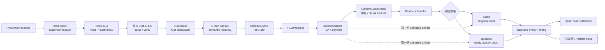

# NPU OOO Simulator

## 整体流程



这是一个用于研究 TISA 风格 NPU 动态调度的编译与仿真框架。项目当前只有一条生产前端路线：

```text
PyTorch nn.Module
  -> torch.export.ExportedProgram
  -> Torch-XLA
  -> 官方 StableHLO
  -> Canonical OperatorGraph
  -> ScheduleSpec / TileGraph
  -> TISAProgram
  -> BackendArtifact
  -> RuntimeSubmission
  -> static / dynamic TISA scheduler
  -> 周期结果、泳道图和 Perfetto trace
```

新增 workload 时只需要提供真实的 PyTorch `nn.Module`，不需要为算子手写 graph builder 或专用 lowering 入口。

## 当前能力

- 使用 `torch.export` 捕获 PyTorch 模型；
- 使用 Torch-XLA 完成 ATen 到 StableHLO 的 legalization；
- 使用 OpenXLA 官方 StableHLO bindings 执行 MLIR parse 和 verify；
- 将支持的 StableHLO semantic family 导入统一 OperatorGraph；
- 自动执行图 canonicalization、复合算子恢复、静态切 tile 和 TISA 生成；
- Static 和 Dynamic device policy 共享同一份 `TISAProgram/BackendArtifact`；
- runtime 单独负责物理地址、command chunk、descriptor availability 和提交开销；
- backend codegen、event engine、timing provider 均可替换；
- 输出 TISA/backend payload timing、SVG/PNG 泳道图和 Perfetto JSON。

当前默认时序仍是 analytical。除非显式加载来自 RTL 的校准 profile，否则结果不能称为 RTL cycle-accurate。

## 环境

正式前端需要同一个 Python 环境同时提供：

```text
Python 3.12
torch 2.9.1
torch-xla 2.9.0
OpenXLA StableHLO wheel
```

本机已验证的解释器是 `/usr/bin/python3.12`。安装细节见 [docs/install-stablehlo.md](docs/install-stablehlo.md)。

## 快速运行

编译并动态调度一个 PyTorch attention micrograph：

```bash
cd /home/lora/OpenTPU/npu-ooo-simulator

PYTHONPATH=src /usr/bin/python3.12 -m npu_ooo.cli compile-model \
  --torch-module examples.torch_models:AttentionMicrograph \
  --input-shape 1,4,8 \
  --input-shape 1,4,8 \
  --input-shape 1,4,8 \
  --tile-size 4 \
  --policy dynamic_ready_queue \
  --output-dir out/attention-dynamic
```

比较 static 和 dynamic 时，只改变 `--policy` 和输出目录：

```bash
PYTHONPATH=src /usr/bin/python3.12 -m npu_ooo.cli compile-model \
  --torch-module examples.torch_models:AttentionMicrograph \
  --input-shape 1,4,8 --input-shape 1,4,8 --input-shape 1,4,8 \
  --tile-size 4 \
  --policy static_pipeline \
  --output-dir out/attention-static
```

两次编译使用相同 shape、tile planner 和 backend。实验脚本若要求严格共享同一个已编译 artifact，可使用：

```text
--runtime-device-matrix
```

它在一次编译后运行 runtime static/dynamic 与 device static/dynamic 的四种组合。

## 添加 PyTorch 算子或模型

在任意可导入 Python 模块中定义真实的 `torch.nn.Module`。无参数构造的 module class 可以直接作为 CLI 入口：

```python
import torch

class MyOperator(torch.nn.Module):
    def forward(self, lhs, rhs):
        return torch.matmul(lhs, rhs)
```

然后运行：

```bash
PYTHONPATH=src:/path/to/module /usr/bin/python3.12 -m npu_ooo.cli compile-model \
  --torch-module my_module:MyOperator \
  --input-shape 32,64 \
  --input-shape 64,128 \
  --output-dir out/my-operator
```

每个 `--input-shape` 对应一个 positional tensor input。CLI 会生成确定性的随机 example input；它们用于 `torch.export` 的 shape/dtype 捕获，不用于数值正确性评估。

若 Torch-XLA 产生了项目尚未注册的 StableHLO operation，编译会在 StableHLO semantic capability boundary 明确失败。扩展新算子时，应补充：

```text
StableHLO semantic capability
  -> Canonical op mapping 或 composite recovery pass
  -> TISA stage definition
  -> backend lowering capability
  -> 端到端 PyTorch 测试
```

不要新增按模型名或算子名分支的 CLI/builder 路线。

## 输出目录

```text
out/<run>/
├── manifest.json
├── artifact_index.json
├── 00_frontend/
│   ├── source_frontend_import.json   # torch.export 源图摘要
│   ├── generated.mlir                # Torch-XLA StableHLO
│   ├── stablehlo_module.json         # verifier、版本和 provenance
│   └── frontend_import.json          # StableHLO 导入结果
├── 01_graph_ir/
│   ├── canonical_graph.json
│   └── operator_graph.{dot,svg}
├── 02_schedule_tile/
│   ├── schedule.json
│   └── tile_graph.{json,dot}
├── 03_tisa/
│   ├── tisa_program.json
│   └── compiled_artifact.json
├── 04_backend/
│   ├── backend_artifact.json
│   ├── execution_graph.{json,dot}
│   └── machine.json
├── 05_runtime/
│   ├── runtime_submission.json
│   └── address_dependencies.json
├── 06_simulation/
│   ├── summary.json
│   ├── tasks.csv
│   └── tisa_instructions.csv
└── 07_trace/
    ├── swimlane.{svg,png}
    └── perfetto.json
```

推荐按目录编号依次检查。`generated.mlir` 是确认 Torch-XLA 输出的第一现场，`tisa_program.json` 是 device scheduler 的输入，`backend_artifact.json` 记录每条 TISA instruction 对应的后端 payload。

## 调度边界

项目刻意区分三层决策：

```text
编译期：SchedulePlanner 决定 tile size 和 loop order
runtime：决定地址、command chunk 和 descriptor 到达时间
device scheduler：根据依赖、ROB、queue 和资源状态 issue TISA instruction
```

`--policy static_pipeline` 与 `--policy dynamic_ready_queue` 只改变最后一层。两者不会重新切 tile，也不会生成不同的 TISA 程序。

## Backend 与 RTL 校准

默认 registry：

```text
CodegenBackend: analytical
EventBackend: analytical_event
TimingProvider: analytical | timing_table | systolic_mxu_profile
```

导入 RTL trace 和 MXU VCS log 的方法见 [docs/rtl-calibration.md](docs/rtl-calibration.md)。`descriptor_issue_to_done` 与 isolated Matmul compute latency 是不同区间，provider 会拒绝错误映射。

## 代码导航

```text
src/npu_ooo/cli.py                       唯一用户入口和实验输出
src/npu_ooo/compiler/pipeline.py         线性 PyTorch-to-TISA 主流程
src/npu_ooo/frontend/bridge.py           torch.export 捕获与源图 provenance
src/npu_ooo/frontend/torch_xla_export.py Torch-XLA StableHLO 导出
src/npu_ooo/frontend/stablehlo_official.py 官方 verifier 和导入边界
src/npu_ooo/compiler/passes.py           Canonical graph passes
src/npu_ooo/compiler/planner.py          自动 tile planner
src/npu_ooo/compiler/tisa_first.py       TileGraph 到 TISA descriptors
src/npu_ooo/backend/                     可替换 backend 与 timing provider
src/npu_ooo/simulator/tisa.py            TISA device scheduler simulator
```

完整分层说明见 [docs/architecture.md](docs/architecture.md)，论文语义对齐见 [docs/tisa-alignment.md](docs/tisa-alignment.md)。

## 验证

```bash
PYTHONPATH=src /usr/bin/python3.12 -m unittest discover -s tests -v
PYTHONPATH=src /usr/bin/python3.12 -m compileall -q src tests examples
git diff --check
```

端到端测试真实调用 PyTorch、Torch-XLA 和官方 StableHLO；后端和 scheduler 单元测试可以直接构造其所属层的 IR，但这些 fixture 不是用户前端入口。
