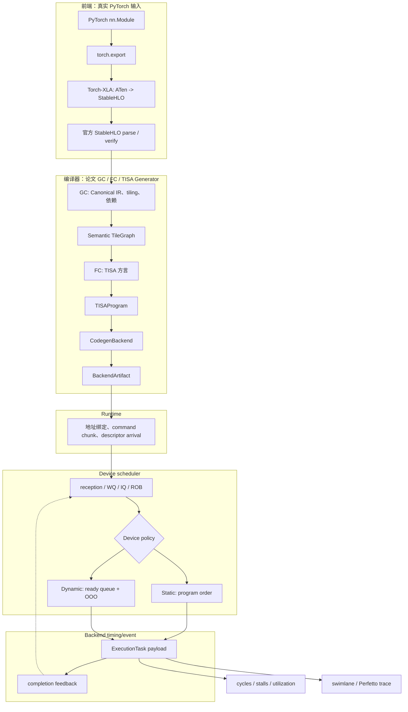

# 整体架构

## 总体流程图



`Static` 与 `Dynamic` 共享同一份 `BackendArtifact`。Runtime policy 和 device policy
分别描述 descriptor 到达与到达后的 issue 选择，是两个独立实验轴。

## 1. 分层契约

生产输入是 PyTorch `nn.Module`。各层的输入输出如下：

| 层 | 输入 | 输出 | 语义职责 |
| --- | --- | --- | --- |
| Frontend | module + example tensors | ExportedProgram、StableHLO module、provenance | 捕获 PyTorch 语义并完成官方 StableHLO 验证 |
| GC | StableHLO projection | `GCArtifact` | canonicalization、semantic recovery、tiling、region/state dependency |
| FC | `GCArtifact` | `TISADialectProgram` | 把 tile stage 具体化为 TISA operands、UnitMap 和 typed deps |
| TISA Generator | TISA 方言 | `TISAProgram` | 规范化 scheduler-visible descriptor |
| CodegenBackend | `TISAProgram` + `MachineConfig` | `BackendArtifact` | 生成 execution graph、payload 和 timing contract |
| Runtime | `BackendArtifact` + bindings | `RuntimeSubmission` | 物理地址、command chunk、到达时间和同步 |
| Device scheduler | submission + policy | schedule result | 处理 queue/ROB、依赖、资源和 issue |
| Event backend | issued instruction + payload | events、cycles、trace | 计算执行时序并输出可视化 |

编译层保留语义信息，后端层提供硬件执行细节，runtime 层管理 invocation 生命周期。

## 2. 主调用链

CLI 入口位于 `src/npu_ooo/cli.py`：

```text
main
  -> run_compile / run_simulate / run_compile_and_sim
  -> compile_torch_module
       -> TorchExportAdapter
       -> Torch-XLA exporter
       -> shape specialization
       -> OfficialStableHLOAdapter
       -> GraphCompiler
       -> FusionCompiler
       -> TISAGenerator
       -> CodegenBackend
       -> RuntimeSubmission
       -> schedule_tisa_program
       -> trace writer
```

`compile_operator_graph()` 接受已经导入的 Canonical graph，用于单独验证 GC、FC 和
backend 契约。用户 CLI 提供 `compile`、`simulate` 和 `compile-and-sim` 三个入口：前者
生成 compile package，第二个只消费 package，第三个串联两者。

## 3. Frontend

### 3.1 PyTorch 与 torch.export

```python
exported_program = torch.export.export(module, args, **export_kwargs)
```

`ExportedProgram` 包含 FX/ATen graph、graph signature、参数与 buffer 描述以及 shape
constraint。example tensors 确定本次编译的 rank、dtype 和 shape。源图摘要写入
`00_frontend/source_frontend_import.json`，用于 provenance 和前后端对照。

### 3.2 Torch-XLA 与官方 StableHLO

Torch-XLA 将 ATen 语义导出为 StableHLO。项目保存可读 MLIR、bytecode hash、版本和
导出 provenance 到 `00_frontend/generated.mlir` 与 `stablehlo_module.json`。

`OfficialStableHLOAdapter` 使用 OpenXLA bindings 完成：

```text
register StableHLO dialect
  -> Module.parse(text)
  -> module.operation.verify()
  -> canonical assembly
```

项目维护 StableHLO semantic family 到 Canonical/TISA/backend capability 的映射。
`StableHLOOpCapabilityRegistry` 负责单条 operation；`SemanticFusionPatternRegistry`
负责经过 shape、常量和数据流证明的多节点语义恢复。operation capability 诊断包含原始
名称、规范名称、缺失注册项和已知 operation 集合。

dtype 名称由 IR 级共享 registry 解析。StableHLO 的 `i32/i64/ui*` 和 PyTorch/Canonical
别名使用同一 capability family 与 storage byte width，避免索引 tensor 在编译边界被误判。

### 3.3 Shape specialization

Torch-XLA 对动态 shape 生成 `get_dimension_size`、shape tensor 和 dynamic
operation。compiler 在官方 parse/verify 前执行 operation-level specialization：

- `get_dimension_size -> reshape -> concatenate -> maximum` 可求值时，广播转换为
  静态 `broadcast_in_dim`；
- 常量 start 的 `dynamic_slice` 按 StableHLO clamp 语义转换为 `slice`；
- 常量 shape tensor 的 `dynamic_reshape` 在目标维度为正数且元素总数守恒时转换为
  `reshape`；
- shape-only SSA 在转换后清理，variant、shape environment 和诊断写入 artifact。

这一阶段产出经过语义验证的 StableHLO module。常量索引在 specialization 中静态化；
运行时索引保留为 `DynamicIndexExpr`，由 runtime `DynamicIndexBinding` 提供本次 invocation
的具体值。`dynamic_update_slice` 同时生成 `stateful/state_id/state_buffer` contract，并
将结果 alias 到 persistent state buffer。runtime 先按 StableHLO clamp 规则求解索引，再
使用 buffer 的 dense 或显式 byte strides 计算动态窗口的 physical offset/span；resolved
region、索引和 provenance 进入 TISA operand 与 address scoreboard。未解析的 StableHLO
layout encoding 经过统一 resolver：可验证的 strides/minor-to-major 进入 concrete stride
metadata，opaque encoding 保留 conservative logical region。

## 4. Graph Compiler（GC）

GC 输入是官方 StableHLO projection，输出 `GCArtifact`：

```text
OperatorGraph
ScheduleSpec
Semantic TileGraph
fusion / residency / locality metadata
typed tile dependencies
initial software order
per-pass graph snapshots
```

### 4.1 Canonical IR

`TensorSpec` 保存 shape、dtype、source kind、layout source 和 layout encoding。
`OperatorSpec` 保存 semantic family、输入输出、iteration/reduction dims、StableHLO
provenance 和 backend capability key。`DataEdge` 连接 producer、consumer 和 tensor。
零秩 tensor 使用 shape `()`，并以单元素 metadata 参与 elementwise region。

### 4.2 Pass pipeline

默认 pass 顺序：

```text
CanonicalizeGraphPass
LinearDecompositionPass
RecoverStableHLOLayerNormPass
RecoverStableHLOFlattenedLinearPass
FoldTransposeIntoMatmulPass
LayerNormFusionPass
RMSNormFusionPass
SoftmaxFusionPass
RotaryEmbeddingRegionPass
AttentionRegionPass
SwiGLUFusionPass
```

GC 通过 fixed-point recovery 处理同一图中的多个规范化节点。复合语义以 region metadata
保留可观察成员：

- Attention region 记录 `QK^T -> score transform -> Softmax -> probability transform
  -> PV`，成员继续生成独立 TISA；
- RoPE region 记录 `value * cos + rotate_half(value) * sin`，Q/K 路径和旋转元数据
  继续可见；
- SwiGLU semantic operator 收敛 `logistic -> silu multiply -> gate multiply`，内部
  primitive 由同一 vector payload 承担；
- KV-cache recovery 识别固定窗口 `slice(cache) + concatenate(update)`，生成带
  `state_id/state_buffer` 的 `kv_cache_update`。

`softmax_algorithm` 是 Softmax lowering 属性：`materialized` 生成完整中间结果，
`online` 生成跨 reduction tile 的 `(max, sum)` state chain。该属性沿 GC、FC 和
backend payload 传递，device policy 独立配置。

### 4.3 Tiling、locality 与依赖

`SchedulePlanner` 的 baseline：

```text
tile_size(dim) = min(requested tile size, resolved extent)
loop_order = iteration dims + reduction dims
stage_id = operator topological order
```

`--tile-size-candidates` 启用 `cost-model-v1`，按 tile 数、估算计算周期、root
traffic 和 local working-set 计算候选分数，选择分数最低的候选并记录
`candidate_costs` 与 `selected_tile_size`。

`MachineConfig` 提供 memory capacity 时，planner 生成 residency intent 和双缓冲
ping-pong metadata。该 metadata 描述编译期 locality，runtime 负责实际 buffer binding。

`build_tile_graph()` 为每个 `TileInstance` 记录 tile id、operator id、coordinates、
bounds 和 semantic metadata。跨算子边使用 `logical_tensor_region_v1`：producer 与
consumer tile 的逻辑 region 重叠时建立 `TileDependency`，并保存 hazard kind、两侧
logical region、ready condition 和 provenance。数据流边使用 RAW；reduction、state、
accumulate 和 buffer-reuse 分别使用项目扩展关系。Matmul 的 M/N/K、broadcast
elementwise、reduce/norm、卷积/池化 halo 和 full-tensor transform 各有对应投影规则。
映射信息不足时采用记录在统计中的 conservative overlap。

普通 reshape/transpose 使用 full-tensor DMA transform。slice 使用 output-tile copy，
其 source operand 记录动态索引表达式；runtime 绑定后使用动态窗口的具体物理区间。静态 `broadcast_in_dim` 按
输出域切 tile，并依据 `broadcast_dimensions` 投影源 operand region。卷积和 pooling
输入 region 包含 window/kernel halo。FC `TileMem` 保存 scope、logical address
expression、concrete offset/size、`strides_bytes`、`stride_expr`、layout 和 dtype
metadata；可验证 stride 生成 concrete interval，opaque encoding 保留 logical region
并使用 conservative overlap。

## 5. Fusion Compiler（FC）

FC 消费 `GCArtifact` 中的 `OperatorGraph`、`ScheduleSpec` 和 `TileGraph`，
把每个 semantic tile stage 具体化为 TISA 方言 operation：

```text
OpType / semantic family
Operands: TileShape + TileMem + AccessType
UnitMap
typed dependencies + readiness condition + provenance
fusion / reorder attributes
backend payload recipe
```

核心过程：

1. 验证 `GCArtifact`；
2. 按 TileGraph 拓扑顺序选择 operator family 的 stage 模板；
3. 将 tile bounds 投影到输入输出 tensor，构造 `TISAOperand`；
4. 写入 UnitMap、semantic metadata、readiness condition 和 payload recipe；
5. 投影 region/state/accumulate/buffer-reuse 边，并补齐同一 tile 的 stage 顺序；
6. 稳定拓扑排序得到 `program_order`，生成 `TISADialectProgram`。

典型 Attention tile：

```text
tisa.load             DE
tisa.load_transpose   DE
tisa.matmul            ME
tisa.softmax           VE
tisa.matmul            ME
tisa.store             DE
```

每条 TISA operation 绑定一个主要 execution unit。Softmax 的
`reduce_max/exp/reduce_sum/normalize` 作为 VE payload primitive，保持 semantic
instruction 的整体依赖和完成边界。

## 6. TISA Generator 与 TISAProgram

`TISAGenerator` 将 TISA 方言规范化为 `TISAProgram`，保留 FC 已确定的 descriptor
语义。每条 `TISAInstruction` 包含：

```text
tisa_id / tile_id / operator_id
op_type
TISAOperand(tile shape, TileMem, access type)
UnitMap
typed dependency: kind、condition、provenance
semantic metadata
payload_ref
```

`ExecutionTask` 属于 backend payload，表示同一 TISA issue 后在目标 execution unit
内执行的步骤。全局 scheduler 以 TISA instruction 为唯一调度单位；payload lane 事件
用于 timing 和泳道图。每个 task 的 predecessor metadata 保存对应 GC edge 的
`hazard_kind`、`condition`、logical region 和 provenance；trace 的 `WAKE_UP`、`ISSUE`、
`COMPLETE` 与 address scoreboard event 直接消费这份 metadata。

## 7. BackendArtifact

`CodegenBackend` 接收 `TISAProgram` 并生成：

```text
BackendArtifact {
  program: TISAProgram
  execution_graph: ExecutionGraph
  payloads: tisa_id -> ExecutionTask ids
}
```

默认 lowering registry 覆盖：

```text
matmul / batched_matmul / gemv
elementwise / residual_add
reduce / softmax / rmsnorm / layernorm
reshape / transpose / conv2d / pooling
dtype_convert / kv_cache_update
```

backend 通过 `TimingProvider` 提供 duration 和 initiation interval；`EventBackend`
把 issue、task start、task done、TISA completion 和 resource release 写入统一 trace。

## 8. Runtime

`RuntimeSubmission` 完成：

```text
logical tensor -> physical buffer address
TISA operand -> physical range
command chunk
descriptor available cycle
launch latency
synchronization cost
```

Runtime 可以和编译阶段分开执行。`compile` 将以下文件组成可复用的 compile package：

```text
01_gc/canonical_graph.json
03_tisa/tisa_program.json
04_backend/backend_artifact.json
04_backend/machine.json
manifest.json
```

`simulate --compile-dir <package>` 只读取这些编译产物，然后在本次 invocation 中重新完成
buffer 分配、dynamic index/layout binding、descriptor 提交和 device/backend timing。它不
导入 PyTorch，也不重新执行 Torch-XLA、GC 或 FC。多个 `simulate` 命令可以复用同一个
package，对比不同 MachineConfig、timing provider、runtime policy 和 device policy。

命令参数遵循同一边界：`compile` 只接受前端、shape、tile/GC 和 codegen 选项；`simulate`
接受 runtime、scheduler、MachineConfig 覆盖和 timing/event backend；`compile-and-sim` 将
两组参数组合为一次端到端执行。编译包因此不携带某次仿真的运行时地址、descriptor 顺序
或调度结果。

Runtime policy 表示 descriptor 的生成和提交顺序；device policy 表示已到达 TISA
instruction 的 issue 选择。四种组合由 `--runtime-device-matrix` 一次编译后运行。

Runtime submission 还携带 `DynamicIndexBinding`。binding 的 expression id 必须匹配
TISA 的 `dynamic_index` metadata，值的 rank 按 expression contract 校验。runtime 为每个
operand 记录 clamp 后的索引、dynamic region、physical offset/span 和 provenance；TISA
address scoreboard 直接消费这些范围。`RuntimeLayoutBinding` 可以在每个 invocation 绑定
具体 shape、byte strides、layout 和 offset，并沿同一 resolver 更新 operand 的 physical
region；bank-aware 映射使用这些 resolved 地址。

固定窗口 KV-cache 携带 `state_id/state_buffer`。`RuntimeStateRegistry` 绑定稳定的
persistent address、memory scope 和容量；`RuntimeSequence` 为同一 `BackendArtifact`
创建多次 invocation，并加入：

```text
invocation[n-1] --state_complete(state_id)--> invocation[n]
```

sequence simulator 合并每个 invocation 的事件和 timing，输出
`STATE_RELEASE/STATE_WAIT/STATE_READY`。当前 state contract 定义固定 shape、unit
stride、固定窗口和顺序 decode；动态 position、paged cache、跨 request ownership 和
完整 cache layout 作为后续 runtime capability。

## 9. Device Scheduler

`schedule_tisa_program()` 消费 BackendArtifact、MachineConfig、RuntimeSubmission、
SimulatorConfig、TimingProvider 和 EventBackend。

```text
static_pipeline:
  按 program order 与依赖约束 issue

dynamic_ready_queue:
  在 dependency window / ROB / ready queue 内选择
  已到达、依赖满足、UnitMap 可用的 TISA instruction
```

可配置参数包括 instruction queue depth、ROB entries、dependency window、ready queue
depth、max inflight tiles、address scoreboard 和 dynamic priority。

`address scoreboard` 的 RAW/WAR/WAW 观察包含 predecessor、successor、tensor、memory、
condition 和 provenance。若冲突来自编译期 GC edge，记录中嵌入同一条 TISA dependency；
若冲突只由运行时物理区间产生，记录 `address_scoreboard` 作为来源。

memory bank scoreboard 读取 `MachineConfig.memory_levels` 的 bank 数、bank width、
read/write ports，为 active TISA instruction 建立 analytical reservation，并记录
`memory_bank_block_events`。该模型提供结构冲突趋势；真实 SRAM/DRAM 时序由专用
memory backend 提供。

## 10. 可插拔后端与配置

| 接口 | 输入/输出 | 当前实现 |
| --- | --- | --- |
| `CodegenBackend` | TISAProgram -> backend payload | analytical |
| `TimingProvider` | ExecutionTask -> duration/II | analytical、timing_table、systolic_mxu_profile |
| `EventBackend` | TISA + payload -> event execution | analytical_event |

`MachineConfig` 描述 execution unit 数量、memory hierarchy、interconnect、队列容量和
默认 timing。配置变化作用于 backend 和 scheduler 参数，IR schema 保持一致。

## 11. 输出与复现

artifact 按 `00_frontend` 到 `07_trace` 分层。比较策略时固定 module、example
shape/dtype、Torch-XLA/StableHLO version、tile size、MachineConfig、BackendArtifact、
TimingProvider 和 RuntimeSubmission；实验变量明确写入 manifest。

`compile_statistics.json` 保存 per-operator tile/TISA/payload、MAC、root traffic 和
dependency 数量。`manifest.json` 保存 frontend path、工具版本、machine hash、backend、
policy、TISA instruction count、cycle 和 calibration status。

## 12. 当前范围与扩展项

当前生产链路覆盖：

- Matmul、batched Matmul、GEMV、elementwise、reduce、Softmax、LayerNorm、RMSNorm；
- Attention、SwiGLU、RoPE、Conv2D、BatchNorm inference、max/avg pooling；
- reshape/transpose、slice、静态 broadcast、scalar tensor、dtype convert；
- 固定窗口 KV-cache、dynamic_update_slice state contract 与多步 RuntimeSequence；
- analytical、timing table、systolic MXU profile 和 RTL completion trace importer。

扩展项按以下顺序推进：

1. 更复杂 StableHLO layout dialect 的扩展与 bank-aware memory timing 校准；
2. online Softmax 的数值 rescale、最终 normalization 与 workspace 生命周期；
3. 完整 ResNet/BERT/GPT-J/LLaMA2 模型 repetition、DeepSeek MoE routing；
4. 论文 WQ/IQ/Fu 容量、dispatch/wake-up/issue/completion 控制开销的硬件校准；
5. SCALE-Sim、Ramulator2/DRAMSys、RTL/Verilator 和 system simulator adapter。

当前结果标签为 `TISA instruction-level analytical scheduling baseline`。加载相应
profile 后，结果标签随 manifest 的 calibration status 变化；trace schema 和编译产物
保持一致。
