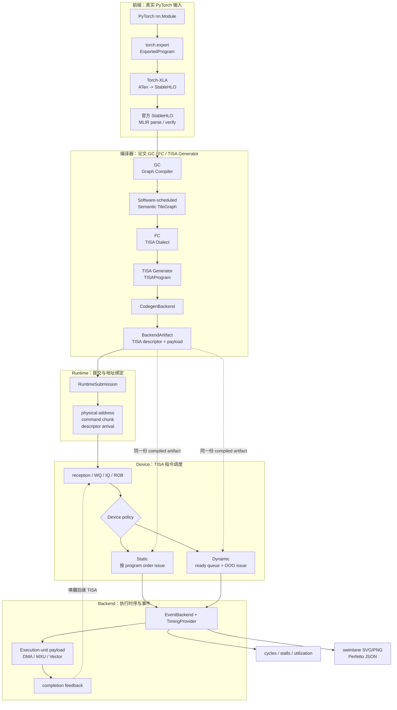

# 整体架构

## 总体流程图



图中 `Static` 和 `Dynamic` 共享同一份 `BackendArtifact`；`RuntimeSubmission` 的提交策略与 device scheduler policy 是两个独立实验维度。

## 1. 设计约束

当前架构遵守五条约束：

1. 用户输入只能是 PyTorch `nn.Module`；
2. ATen 到 StableHLO 由 Torch-XLA 负责，不在项目内维护逐算子 emitter；
3. Static 和 Dynamic device scheduler 必须消费同一份 compiled artifact；
4. runtime software scheduling 与 TISA hardware scheduling 分层；
5. analytical、trace-calibrated 和未来 RTL/system backend 使用相同接口，但不得混淆精度声明。

因此生产流程只有一条：

```text
PyTorch nn.Module
  -> torch.export.ExportedProgram
  -> Torch-XLA StableHLO
  -> official StableHLO parse/verify
  -> Graph Compiler (GC)
  -> software-scheduled Semantic TileGraph
  -> Fusion Compiler (FC)
  -> TISA dialect
  -> TISA Generator
  -> TISAProgram
  -> BackendArtifact
  -> RuntimeSubmission
  -> TISA device simulation
```

单元测试可以直接构造某一层 IR，以隔离验证该层契约；用户前端不接受手写 graph、Canonical JSON 或 StableHLO 文件。

## 2. 主调用链

CLI 调用关系：

```text
npu_ooo.cli.main
  -> run_compile_model
  -> compile_torch_module
```

`compile_torch_module()` 位于 `src/npu_ooo/compiler/pipeline.py`，按顺序调用 Framework Bridge、GC、FC、TISA Generator 和 Backend。`compile_operator_graph()` 是 StableHLO 已导入后的公共入口，便于隔离测试各编译阶段。

## 3. 前端

### 3.1 PyTorch 捕获

```python
exported_program = torch.export.export(module, args, ...)
```

输出是 `torch.export.ExportedProgram`，包含 FX/ATen graph、graph signature、参数/buffer 描述和 shape constraint。example inputs 决定本次捕获的输入 rank、dtype 和静态 shape。

`TorchExportAdapter.from_exported_program()` 同时生成源图摘要，写入 `00_frontend/source_frontend_import.json`。这份图用于 provenance 和前后端语义对照，不是后续 StableHLO 编译的替代路径。

### 3.2 Torch-XLA legalization

```python
exported_program_to_stablehlo(exported_program, options)
```

Torch-XLA 负责将 ATen 语义转换为 StableHLO。项目保存可读 StableHLO、bytecode 大小/hash 和 Torch-XLA 版本。可读程序位于 `00_frontend/generated.mlir`。

### 3.3 官方 StableHLO 边界

`OfficialStableHLOAdapter` 使用 OpenXLA Python bindings：

```text
register StableHLO dialect
  -> Module.parse(text)
  -> module.operation.verify()
  -> canonical assembly
```

项目不再包含 `stablehlo_codegen.py` 或 `OfficialStableHLOGenerator`。官方 bindings 负责语法和 dialect 验证，项目只维护：

```text
StableHLO semantic family
  -> Canonical OperatorSpec
  -> backend capability key
```

当前 importer 仍有明确限制：官方 MLIR object 先投影到项目支持的可读 operation 子集，再由 semantic importer 建图。未注册 operation 会在 capability boundary 失败，不会静默降级。

动态 shape 还有一层更早的边界：Torch-XLA 会为 `tensor<?x...>` 生成
`stablehlo.get_dimension_size`、`dynamic_broadcast_in_dim` 和 shape-tensor 子图。当前
compiler 会明确报告需要 StableHLO shape-specialization pass；`shape_environment` 只能
解析已经进入 Canonical IR 的符号，不能被误用为对 StableHLO shape program 的文本替换。

## 4. Graph Compiler（GC）

GC 的输入是已经由官方 MLIR bindings 验证的 StableHLO projection；其第一步导入 Canonical OperatorGraph。恢复的信息包括：

```text
TensorSpec: shape、dtype、source kind
OperatorSpec: semantic type、inputs/outputs、iteration/reduction dims
DataEdge: producer、consumer、tensor
StableHLO provenance: source op、operand arity、capability key
```

当前 GC pass 顺序：

```text
CanonicalizeGraphPass
LinearDecompositionPass
RecoverStableHLOLayerNormPass
RecoverStableHLOFlattenedLinearPass
FoldTransposeIntoMatmulPass
LayerNormFusionPass
RMSNormFusionPass
    SoftmaxFusionPass
    RotaryEmbeddingRegionPass
    AttentionRegionPass
SwiGLUFusionPass
```

Torch-XLA 可能把复合算子展开为 primitive 子图，recovery/fusion pass 依据图结构、shape 和常量恢复 GC 所需的语义边界，不能按模型名匹配。

GC 明确区分两类扩展点：

```text
StableHLOOpCapabilityRegistry
  单条 StableHLO operation -> Canonical OperatorSpec

SemanticFusionPatternRegistry
  多节点 Canonical 子图 -> 已证明等价的 semantic operator / region
```

默认 semantic pattern registry 当前注册 LayerNorm recovery、LayerNorm、RMSNorm、
Softmax、RoPE region recovery、Attention region recovery 和 SwiGLU，并以稳定 priority
与 canonical/linear/transpose 等结构 pass 合并成上述 pipeline。未知 StableHLO operation
必须先在 importer capability boundary 显式失败；
fusion registry 不能作为绕过未支持 operation 的 fallback。后续 Attention 应保留
`QK^T Matmul -> Softmax -> PV Matmul` 的 region 内部结构，SwiGLU 也应在证明完整子图、
shape 和单消费者条件后再注册，不能仅凭模型名折叠。

当前实现中，RoPE pattern 识别 `value * cos + rotate_half(value) * sin`，将共享的
cos/sin/rotation matrix 和 Q/K 两条路径记录为非 opaque `rotary_embedding` region，
保留每个底层成员的独立 TISA。Attention pattern 只添加非 opaque region metadata，并
保留 QK、Softmax、PV 及中间 reshape/scale/mask 节点的独立 TISA；SwiGLU pattern 则将已证明等价的
vector primitive chain 收敛为一个 `swiglu` TISA 边界，内部步骤留在该指令的 backend
payload 中。输入图若包含 dtype round-trip，转换步骤也会作为 payload primitive 保留。

KV-cache recovery 当前只接受固定窗口的 `slice(cache) + concatenate(update)` 形式；
`examples/paper_benchmarks/llama2.py` 中的 `LLaMA2DecodeOneBlock` 用真实 PyTorch
one-token decode 图覆盖该 contract。
GC 将其收敛为带 `state_id/state_buffer` 的 `kv_cache_update`，输出 tensor 与持久
state buffer 建立别名；FC 生成 `load -> kv_cache_update -> store` 三个 stage，runtime
要求对应 buffer 标记为 `persistent` 并在 submission 中导出 state contract。多步 decode
通过 `RuntimeStateRegistry` 与 `RuntimeSequence` 复用该地址，并以 `state_complete` 串联
invocation；该 contract 不等价于已实现动态索引、paged cache、跨 request ownership 或
真实 LLaMA decode cache layout。

`softmax_algorithm` 的传播路径是：CLI 或 `MachineConfig.attributes` 给出
`materialized`/`online` 选择；GC 首先校验取值，然后把它写入 canonical Softmax
operator 的 attributes，再交给 planner 和 `TileGraph`。它只选择 Softmax 的实现
语义，不选择 static/dynamic scheduler，也不改变 tile size。之后 FC 读取同一个
attribute：materialized 生成 `reduce_max/exp/reduce_sum/normalize` payload recipe，
online 生成 `online_update` recipe，并为同一 reduction row 的相邻 tile 写入
`STATE` dependency。backend lowering 最后使用该属性生成对应的 primitive task graph。

GC 的最终产物是 `GCArtifact`，由以下内容组成：

```text
OperatorGraph
ScheduleSpec
Semantic TileGraph
fusion / residency / locality metadata
typed tile dependencies
initial software order
per-pass input/output graph snapshots
```

`GCArtifact` 的 Python dataclass 是论文 MLIR GC dialect 的语义代理，不声称复刻论文内部 pass 实现。

每个 GC pass 都保留独立的输入图、输出图和诊断，CLI 将它们写入
`01_gc/pass_dumps/<index>_<pass>.json`。这些 dump 用于解释图恢复和融合
发生在哪一个 pass，不参与后续调度。

### 4.1 Tiling、locality 与依赖

`SchedulePlanner` 当前调用统一的 `plan_uniform_tiles()` baseline：

```text
tile_size(dim) = min(CLI tile_size, resolved extent)
loop_order = iteration dims + reduction dims
stage_id = operator topological order
```

当 CLI 提供 `--tile-size-candidates` 时，GC 对每个候选生成同一套 semantic schedule，
用 `cost-model-v1` 估算 tile 数、tile-local compute、root-memory traffic 和 local
working-set overflow，选择分数最低且 tile size 最小优先的方案。候选分数写入
`ScheduleSpec.attributes.candidate_costs`；这只是可解释的编译期 ranking，不改变 TISA
语义，也不替代 EventBackend 的执行时序。

在 `MachineConfig` 可用时，planner 还生成 capacity-aware 的 residency intent：
优先将当前 operator 的输入/输出放入 root 的第一级 local memory，超出容量的
tensor 保留在 root memory。多 tile operator 会附带 `ping_pong` 计划，描述两个
local tile slot 的交替意图；它是 GC metadata，不是 runtime 的实际 buffer 分配。

每个 pass 的图快照和上述 memory intent 都是分析产物。它们不会改变
`TISAProgram` 的指令顺序，也不会替 device scheduler 做 issue 决策。

这是 GC 的初始软件 schedule，不是 static device scheduler。它决定 tile decomposition、初始 loop order 和可记录的 residency；最终 issue 顺序仍由 device scheduler 决定。

`build_tile_graph()` 根据 schedule 枚举 `TileInstance`，并保留 tile id、operator id、coordinates、边界和 semantic metadata。除跨算子 region edge 外，GC 还生成 reduction/state/accumulate 边，使软件 TileGraph 在进入 FC 前已经完整表达 tile 级合法性。

跨算子依赖使用 `logical_tensor_region_v1`：compiler 将 producer/consumer tile 投影到共享 tensor 的逻辑 region，只为重叠 region 建边。Matmul 的 M/N/K、broadcast elementwise、reduce/norm 和 full-tensor transform 都有显式映射；无法证明映射时才对该 operator edge 保守回退 all-to-all。`compile_statistics.json` 会记录回退边数和避免的无效依赖数。

当前 reshape/transpose 采用保守的 full-tensor schedule。reshape 映射为 DMA copy，transpose 映射为 DMA transpose。FC 的 `TileMem` 已为每个 operand 保存 `strides_bytes`、可读的 `stride_expr` 和 `layout`；这些字段描述 logical addressing，当前 concrete offset/size 仍按 conservative dense range 计算，后续 stride-aware region planner 再将其细化为 tile transform。

## 5. Fusion Compiler（FC）

FC 接收 `GCArtifact`，不再直接从普通 `OperatorGraph` 重新推导 tile。它将融合区域和 tile stage 专化为 TISA dialect operations，并为每条 scheduler-visible operation 附加：

```text
OpType / semantic operator
Operands: TileShape + TileMem + AccessType
typed Deps and readiness condition
UnitMap
fusion / reorder attributes
backend payload recipe
```

当前 Python 语义代理位于 `compiler/tisa_dialect.py`，核心过程是：

1. `FusionCompiler.compile()` 先验证 `GCArtifact`，只消费其中的
   `OperatorGraph`、`ScheduleSpec` 和 `TileGraph`。
2. `TISASemanticBuilder` 按 TileGraph 的拓扑顺序访问每个 `TileInstance`，依据
   operator family 选择 stage，例如 Matmul 是 `load -> matmul -> store`，
   Softmax 是 `load -> softmax -> store`，transpose 是一个 DMA transform stage。
3. `_stage_operands()` 将 tile 的 bounds 投影到每个输入/输出 tensor，生成
   `TileShape + TileMem + AccessType`；`TileMem` 同时保存逻辑 slice、concrete
   offset/size 和 stride metadata。
4. builder 为每个 stage 创建临时 `TISAInstruction`，填充 `UnitMap`、semantic
   family、readiness condition、payload primitive recipe 和 FC metadata。
5. builder 将 TileGraph 的 region/state/accumulate/buffer-reuse 边投影为 typed
   TISA dependencies，再补充同一 tile 的 stage 顺序、reduction barrier 和
   Matmul partial-accumulate 边。
6. 最后对依赖图做稳定拓扑排序，写入 `program_order`，验证依赖 source 必须先于
   target，并包装为 `TISADialectProgram`。此阶段不读取 `ExecutionTask`，也不做
   backend-specific primitive scheduling。

随后 `TISAGenerator` 只把这个 dialect proxy 规范化为 `TISAProgram`，
`AnalyticalBackendCodegen` 才调用 lowering registry，将每条 TISA instruction 绑定
到同一 tile 的 backend-local payload。这样 FC 的 TISA 方言和具体硬件 payload
保持解耦。

FC 同时给每条 stage 写入 `readiness_condition`。默认编译条件
`input_region_ready`、`operand_regions_ready`、`semantic_tile_ready` 和
`output_region_ready` 都在 source TISA 完成时满足，因此不会改变现有 analytical
cycle baseline。simulator 另外支持显式的 `payload_ready:<task_id>` 条件：它把
source payload 中指定 task 的完成时间作为依赖 ready 时间，并产生
`TISA_PARTIAL_READY` trace 事件。该语法用于校准 backend 或 micro-test，当前 GC
不会自动生成它；payload 仍然是父 TISA 内部执行，不会进入全局 ready queue。

一个 Attention tile 的 FC 输出类似：

```text
tisa.load           <de>
tisa.load_transpose <de>
tisa.matmul         <me>
tisa.softmax        <ve>
tisa.matmul         <me>
tisa.store          <de>
```

每条 TISA operation 只绑定一种主要 EU。Softmax 的 `reduce_max/exp/reduce_sum/normalize` 属于 VE 内部 payload recipe，不再作为全局 scheduler 的独立 TISA instruction。

`TISADialectProgram` 是 FC 的 Python 语义代理，明确标注 `paper_stage=FC` 和 `dialect=tisa`。

## 6. TISA Generator 与 TISAProgram

`TISAGenerator` 将 `TISADialectProgram` 序列化为 `TISAProgram`。它不再做新的 tiling、fusion 或 backend primitive 推导，只保留 FC 已经确定的 descriptor 语义。

当前一个 semantic tile 的 TISA 结构为：

```text
load -> optional load_transpose -> matmul -> optional store
```

复合算子：

```text
load -> softmax -> store
默认 backend payload: reduce_max -> exp -> reduce_sum -> normalize
```

这里的 `softmax` 是 scheduler-visible 的语义指令。当前 analytical backend
默认使用 materialized 的 row-wise `max/sum` lowering；这些 primitive 只在该
payload 内执行，不代表已经实现论文目标的 online Softmax state update。通过
`MachineConfig.attributes["softmax_algorithm"] = "online"` 或 CLI 的
`--softmax-algorithm online` 可切换到分析版 online lowering。该模式保持同一个
TISA 语义边界，只替换 payload 为 `online_update`，并由 GC/FC 为同一 reduction
row 的相邻 tile 添加 `STATE` 依赖。它目前只建模 scheduler-visible 的 `(max, sum)`
状态传递，不执行完整数值算法所需的 rescale、最终 normalization 和 workspace，
因此不能称为论文硬件的 cycle-accurate 或数值正确 online Softmax 实现。

每条 `TISAInstruction` 包含：

```text
tisa_id / tile_id / operator_id
op_type
TISAOperand(tile shape, TileMem, access type)
UnitMap
typed dependency（RAW/WAR/WAW/STATE/ACCUMULATE）
semantic metadata
payload_ref
```

TISA Generator 不查看 backend `ExecutionTask`，因此 TISA 契约独立于具体硬件 payload。`TISAInstruction` 的依赖 kind 允许 `RAW/WAR/WAW/STATE/ACCUMULATE/BUFFER_REUSE`，scheduler 当前统一按 source readiness 执行。

## 7. BackendArtifact

`CodegenBackend` 接收已经构造好的 TISAProgram，并为每条 TISA instruction 生成 backend-local payload：

```text
BackendArtifact {
  program: TISAProgram
  execution_graph: ExecutionGraph
  payloads: tisa_id -> ExecutionTask ids
}
```

全局 OOO window 中只允许出现 TISA instruction。`ExecutionTask` 是一条 TISA issue 后，在目标 execution unit 内部执行的步骤，不能重新进入全局 scheduler。

默认 `AnalyticalCodegenBackend` 通过 lowering registry 支持：

```text
matmul / batched_matmul / gemv
elementwise / residual_add
reduce
softmax
rmsnorm
layernorm
reshape / transpose
```

新硬件 backend 应实现同一 `CodegenBackend` contract，而不是在 CLI 中增加新分支。

## 8. Runtime

RuntimeSubmission 位于编译 artifact 与 device scheduler 之间，负责：

```text
logical tensor -> physical buffer address
TISA operand -> physical range
command chunk
descriptor available cycle
launch latency
synchronization cost
```

Runtime 的 `dynamic_ready_queue` 表示软件提交顺序可以绕过尚未到达的独立 descriptor。它不等于论文的 device-side OOO：

```text
runtime policy: 描述符何时到达设备
device policy: 已到达描述符何时 issue 到 execution unit
```

两层可通过 `--runtime-device-matrix` 形成四组合实验。

### 8.1 跨 invocation state

固定窗口 KV-cache 在单次编译中携带 `state_id/state_buffer`。运行时通过
`RuntimeStateRegistry` 将该 state 绑定到稳定的物理地址，并保留同一组普通输入/输出
buffer。需要重复执行同一个 decode block 时，`RuntimeSequence` 复用同一份
`BackendArtifact`，为每次 invocation 创建独立的 command chunks，并显式添加：

```text
invocation[n-1] --state_complete(state_id)--> invocation[n]
```

sequence simulator 逐 invocation 调用同一个 EventBackend，在前一步完成后再提交下一步，
把事件和 timing 平移合并；`STATE_RELEASE/STATE_WAIT/STATE_READY` 事件用于在 trace 中
核对状态边界。persistent buffer 不参与普通临时 tensor 的 lifetime reuse，且所有
invocation 必须保持相同的地址、memory scope 和容量。当前 contract 仍限定为固定 shape、
unit stride、固定窗口的 `slice + concatenate`，不代表完整动态 KV-cache runtime。

## 9. Device Scheduler

`schedule_tisa_program()` 消费 BackendArtifact、MachineConfig、RuntimeSubmission、SimulatorConfig、TimingProvider 和 EventBackend。

Static 和 Dynamic 共享同一 compiled artifact：

```text
static_pipeline:
  按 program order 和依赖约束 issue

dynamic_ready_queue:
  在 dependency window / ROB / ready queue 内，
  从已到达且依赖满足的 TISA instruction 中选择可 issue 项
```

可配置限制包括 instruction queue depth、ROB entries、dependency window、ready queue depth、max inflight tiles、address scoreboard 和 dynamic priority。

当 `SimulatorConfig.memory_bank_scoreboard=true` 时，scheduler 还会消费
`MachineConfig.memory_levels` 中的 `bank_count`、`bank_width_bytes`、`read_ports`
和 `write_ports`，对 active TISA instruction 建立 analytical memory-port reservation。
同一 memory bank 的读/写端口超出配置容量时，候选 instruction 会被阻塞，并在
`memory_bank_block_events` 中计数。该模型默认关闭；它只表达结构冲突趋势，不是
SRAM/DRAM 的 cycle-accurate 时序。存在 `RuntimeSubmission` 时优先使用 physical
operand scope 和 offset；没有 runtime 时仅处理可解析的 concrete scope，`logical`
scope 会跳过 bank 映射。

## 10. 可插拔后端

| 接口 | 输入/输出 | 当前实现 |
| --- | --- | --- |
| `CodegenBackend` | TISAProgram -> backend payload | `analytical` |
| `TimingProvider` | ExecutionTask -> duration/II | `analytical`、`timing_table`、`systolic_mxu_profile` |
| `EventBackend` | TISA + payload -> event execution | `analytical_event` |

配置化 `MachineConfig` 描述资源数量、memory、interconnect 和默认 timing。配置变化不应改变 IR schema。

## 11. 输出与可复现性

artifact 按 `00_frontend` 到 `07_trace` 分层。比较调度策略时必须固定：

```text
PyTorch module
example input shape/dtype
Torch-XLA/StableHLO version
tile size
MachineConfig
BackendArtifact
TimingProvider
RuntimeSubmission（除非实验变量就是 runtime）
```

`compile_statistics.json` 记录 per-operator tile/TISA/payload 数量、MAC、root-memory traffic 和依赖统计。`manifest.json` 记录 frontend path、工具版本、machine hash、backend、policy、TISA instruction count、cycle 和 calibration status。

## 12. 当前限制

- StableHLO semantic importer 只覆盖已注册 operation；LayerNorm recovery pass 对同一图中的多个 Torch-XLA `batch_norm_training` 形式按 fixed-point 重复执行，直到不再产生新 canonical LayerNorm；RMSNorm recovery 已覆盖带 power、reshape 和 affine weight 的 Torch-XLA 链，但仍要求静态 shape 和可证明的 row-wise reduction；
- Torch-XLA 复合模式恢复仍需扩大真实模型覆盖；
- tile planner 是统一启发式 baseline，尚无 cost model 或 auto-tuning；
- reshape/transpose 当前是 full-tensor DMA transform，尚未支持 stride-aware tile transform；
- analytical backend 不是 cycle-accurate RTL；
- 当前 MXU VCS 日志只有 descriptor-to-done 区间，不能直接作为 isolated Matmul compute latency；
- online Softmax 目前是 scheduler-level analytical state-chain 模型，尚未覆盖完整的数值 rescale、最终 normalization 和 workspace 生命周期；
- ResNet bottleneck、BERT/GPT-J/LLaMA2/DeepSeek dense one-block 已有真实 PyTorch
  micro workload；完整模型规模和 DeepSeek MoE path 尚未形成论文实验集。LLaMA2 的 RoPE
  已接入；KV-cache 当前支持固定窗口
  单步 contract 和多步 `RuntimeSequence` 仿真，但动态写入、真实 cache layout、跨请求
  生命周期和 full depth 仍未实现。

下一阶段见 [roadmap.md](roadmap.md)。
