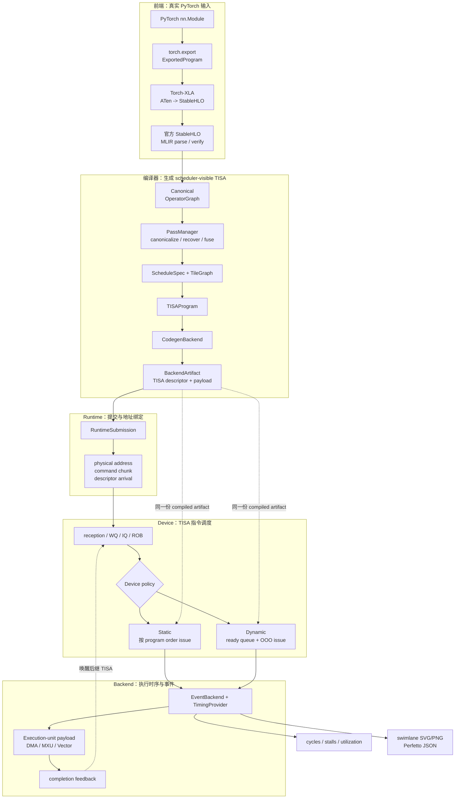

# 整体架构

## 总体流程图



图中 `Static` 和 `Dynamic` 共享同一份 `BackendArtifact`；`RuntimeSubmission` 的提交策略与 device scheduler policy 是两个独立实验维度。

## 1. 设计约束

当前架构遵守五条约束：

1. 用户输入只能是 PyTorch `nn.Module`；
2. ATen 到 StableHLO 由 Torch-XLA 负责，不在项目内维护逐算子 emitter；
3. Static 和 Dynamic device scheduler 必须消费同一份 compiled artifact；
4. runtime software scheduling 与 TISA hardware scheduling 分层；
5. analytical、trace-calibrated 和未来 RTL/system backend 使用相同接口，但不得混淆精度声明。

因此生产流程只有一条：

```text
PyTorch nn.Module
  -> torch.export.ExportedProgram
  -> Torch-XLA StableHLO
  -> official StableHLO parse/verify
  -> Canonical OperatorGraph
  -> graph passes
  -> ScheduleSpec
  -> TileGraph
  -> TISAProgram
  -> BackendArtifact
  -> RuntimeSubmission
  -> TISA device simulation
```

单元测试可以直接构造某一层 IR，以隔离验证该层契约；用户前端不接受手写 graph、Canonical JSON 或 StableHLO 文件。

## 2. 主调用链

CLI 调用关系：

```text
npu_ooo.cli.main
  -> run_compile_model
  -> compile_torch_module
```

`compile_torch_module()` 在一个函数中按执行顺序展示完整前端，位于 `src/npu_ooo/compiler/pipeline.py`。内部仅保留一个需要复用的分界函数 `compile_operator_graph()`，表示 StableHLO 已导入后的 Canonical IR 编译阶段。原先只做参数转发的 wrapper 已删除。

## 3. 前端

### 3.1 PyTorch 捕获

```python
exported_program = torch.export.export(module, args, ...)
```

输出是 `torch.export.ExportedProgram`，包含 FX/ATen graph、graph signature、参数/buffer 描述和 shape constraint。example inputs 决定本次捕获的输入 rank、dtype 和静态 shape。

`TorchExportAdapter.from_exported_program()` 同时生成源图摘要，写入 `00_frontend/source_frontend_import.json`。这份图用于 provenance 和前后端语义对照，不是后续 StableHLO 编译的替代路径。

### 3.2 Torch-XLA legalization

```python
exported_program_to_stablehlo(exported_program, options)
```

Torch-XLA 负责将 ATen 语义转换为 StableHLO。项目保存可读 StableHLO、bytecode 大小/hash 和 Torch-XLA 版本。可读程序位于 `00_frontend/generated.mlir`。

### 3.3 官方 StableHLO 边界

`OfficialStableHLOAdapter` 使用 OpenXLA Python bindings：

```text
register StableHLO dialect
  -> Module.parse(text)
  -> module.operation.verify()
  -> canonical assembly
```

项目不再包含 `stablehlo_codegen.py` 或 `OfficialStableHLOGenerator`。官方 bindings 负责语法和 dialect 验证，项目只维护：

```text
StableHLO semantic family
  -> Canonical OperatorSpec
  -> backend capability key
```

当前 importer 仍有明确限制：官方 MLIR object 先投影到项目支持的可读 operation 子集，再由 semantic importer 建图。未注册 operation 会在 capability boundary 失败，不会静默降级。

## 4. Canonical OperatorGraph

从 StableHLO 恢复的信息包括：

```text
TensorSpec: shape、dtype、source kind
OperatorSpec: semantic type、inputs/outputs、iteration/reduction dims
DataEdge: producer、consumer、tensor
StableHLO provenance: source op、operand arity、capability key
```

PassManager 当前顺序：

```text
CanonicalizeGraphPass
LinearDecompositionPass
RecoverStableHLOLayerNormPass
RecoverStableHLOFlattenedLinearPass
FoldTransposeIntoMatmulPass
LayerNormFusionPass
RMSNormFusionPass
SoftmaxFusionPass
```

Torch-XLA 可能把复合算子展开为 primitive 子图，recovery/fusion pass 尝试恢复 scheduler 需要的语义边界。恢复必须依赖图结构、shape 和常量约束，不能按模型名匹配。

## 5. Schedule 与 TileGraph

`SchedulePlanner` 调用统一的 `plan_uniform_tiles()` baseline：

```text
tile_size(dim) = min(CLI tile_size, resolved extent)
loop_order = iteration dims + reduction dims
stage_id = operator topological order
```

这是编译期静态 tile 规划，不是 static device scheduler。

`build_tile_graph()` 根据 schedule 枚举 `TileInstance`，包含 tile id、operator id、coordinates、每个维度的 `[start, stop)` bounds 和 semantic metadata，并从 operator data edge 建立 tile dependency。

## 6. TISAProgram

`TISASemanticBuilder` 从 OperatorGraph、ScheduleSpec、TileGraph 和 MachineConfig 生成 scheduler-visible descriptors。

当前实现中，一个 semantic tile 会按资源阶段生成多条 TISA instruction。例如 Matmul：

```text
load -> optional load_transpose -> matmul -> optional store
```

Softmax：

```text
load -> reduce_max -> exp -> reduce_sum -> normalize -> store
```

每条 `TISAInstruction` 包含：

```text
tisa_id / tile_id / operator_id
op_type
TISAOperand(tile shape, TileMem, access type)
UnitMap
RAW dependency
semantic metadata
payload_ref
```

Builder 负责同 tile stage 顺序、跨算子依赖、Matmul K 累加和 reduction barrier。它不查看 backend `ExecutionTask`，因此 TISA 契约独立于具体硬件 payload。

## 7. BackendArtifact

`CodegenBackend` 接收已经构造好的 TISAProgram，并为每条 TISA instruction 生成 backend-local payload：

```text
BackendArtifact {
  program: TISAProgram
  execution_graph: ExecutionGraph
  payloads: tisa_id -> ExecutionTask ids
}
```

全局 OOO window 中只允许出现 TISA instruction。`ExecutionTask` 是一条 TISA issue 后，在目标 execution unit 内部执行的步骤，不能重新进入全局 scheduler。

默认 `AnalyticalCodegenBackend` 通过 lowering registry 支持：

```text
matmul / batched_matmul / gemv
elementwise / residual_add
reduce
softmax
rmsnorm
layernorm
```

新硬件 backend 应实现同一 `CodegenBackend` contract，而不是在 CLI 中增加新分支。

## 8. Runtime

RuntimeSubmission 位于编译 artifact 与 device scheduler 之间，负责：

```text
logical tensor -> physical buffer address
TISA operand -> physical range
command chunk
descriptor available cycle
launch latency
synchronization cost
```

Runtime 的 `dynamic_ready_queue` 表示软件提交顺序可以绕过尚未到达的独立 descriptor。它不等于论文的 device-side OOO：

```text
runtime policy: 描述符何时到达设备
device policy: 已到达描述符何时 issue 到 execution unit
```

两层可通过 `--runtime-device-matrix` 形成四组合实验。

## 9. Device Scheduler

`schedule_tisa_program()` 消费 BackendArtifact、MachineConfig、RuntimeSubmission、SimulatorConfig、TimingProvider 和 EventBackend。

Static 和 Dynamic 共享同一 compiled artifact：

```text
static_pipeline:
  按 program order 和依赖约束 issue

dynamic_ready_queue:
  在 dependency window / ROB / ready queue 内，
  从已到达且依赖满足的 TISA instruction 中选择可 issue 项
```

可配置限制包括 instruction queue depth、ROB entries、dependency window、ready queue depth、max inflight tiles、address scoreboard 和 dynamic priority。

## 10. 可插拔后端

| 接口 | 输入/输出 | 当前实现 |
| --- | --- | --- |
| `CodegenBackend` | TISAProgram -> backend payload | `analytical` |
| `TimingProvider` | ExecutionTask -> duration/II | `analytical`、`timing_table`、`systolic_mxu_profile` |
| `EventBackend` | TISA + payload -> event execution | `analytical_event` |

配置化 `MachineConfig` 描述资源数量、memory、interconnect 和默认 timing。配置变化不应改变 IR schema。

## 11. 输出与可复现性

artifact 按 `00_frontend` 到 `07_trace` 分层。比较调度策略时必须固定：

```text
PyTorch module
example input shape/dtype
Torch-XLA/StableHLO version
tile size
MachineConfig
BackendArtifact
TimingProvider
RuntimeSubmission（除非实验变量就是 runtime）
```

`manifest.json` 记录 frontend path、工具版本、machine hash、backend、policy、TISA instruction count、cycle 和 calibration status。

## 12. 当前限制

- StableHLO semantic importer 只覆盖已注册 operation；
- Torch-XLA 复合模式恢复仍需扩大真实模型覆盖；
- tile planner 是统一启发式 baseline，尚无 cost model 或 auto-tuning；
- TileGraph 跨算子依赖仍偏保守；
- analytical backend 不是 cycle-accurate RTL；
- 当前 MXU VCS 日志只有 descriptor-to-done 区间，不能直接作为 isolated Matmul compute latency；
- 真实 ResNet50、BERT、GPT-J、LLaMA2、DeepSeek block 尚未形成可复现实验集。

下一阶段见 [roadmap.md](roadmap.md)。
