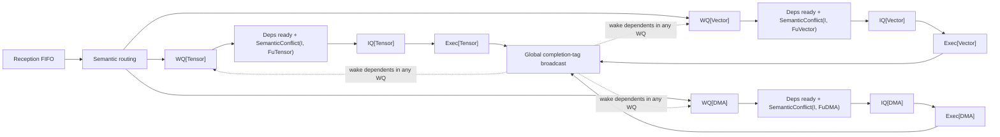

# Scheduler 与 TISA 论文对齐说明

本文供后续 scheduler agent 和实现人员使用，专门说明当前
`cycle_event` scheduler 与 TISA 论文 Section IV/V、Figure 4、Algorithm 1/2 之间的
对应关系，尤其是 `Semantic Conflict Detection`、`Fu` 粒度和跨 EU 依赖。

本文不把论文中没有公开的数据结构或 RTL 细节扩展成“论文事实”。凡是当前项目的实现
选择，均明确标注为项目模型。

## 1. 结论先行

本项目采用以下与论文公开语义相容的实现分层。全局 completion-tag 广播是为了补齐论文
没有公开的跨 EU notification 细节所作的项目选择，不声称 Epoch 使用相同互连：

```text
全局 typed dependency readiness
        +
目标 EU 的本地 SemanticConflict(I, Fu[u])
        +
目标 EU 的结构资源检查
        ↓
issue
```

因此：

1. `Fu` 是每个调度 unit `u` 一个，即 `Fu[Tensor]`、`Fu[Vector]`、`Fu[DMA]`；不是所有 EU 共用一个 Fu。
2. 位于 `WQ[u]` 的候选在执行论文 Algorithm 2 时，主要检查目标 unit 的 `Fu[u]`。
3. 这不意味着候选只检查同 EU 依赖。`Deps` 的 source 是另一条 TISA instruction，依赖可以跨 EU。
4. Tensor producer 完成后，必须让 Vector WQ 中依赖它的 consumer 获得 condition-ready 通知。
5. 当前 `cycle_event` 用全局 completion-tag 广播实现该通知，并实现了本地
   `SemanticConflict(I, Fu[u])` 的保守子集。

## 2. 论文明确给出的机制

论文定义 TISA 指令携带：

```text
OpType
Operands = TileShape + TileMem + AccessType
UnitMap = target unit / quantity / affinity
Deps = {(src, type, condition)}
```

论文 Figure 4 的主路径是：

```text
Reception Buffer
        ↓ semantic routing
WQ[Tensor] / WQ[Vector] / WQ[DMA]
        ↓ ready window + dependency resolution
IQ[Tensor] / IQ[Vector] / IQ[DMA]
        ↓
Exec[Tensor] / Exec[Vector] / Exec[DMA]
        ↓ completion feedback
dependent instructions wake up
```

论文明确说每个执行 unit `u` 维护自己的 in-flight semantic table：

```text
Fu = {
    operand index,
    start address,
    end address,
    access type,
    unit,
    instruction pointer
}
```

候选指令 `I` 被发往 unit `u` 时，执行：

```text
Hazard(I, Fu[u]) =
    exists r in Fu[u] such that SemanticConflict(I, r)
```

论文 Algorithm 2 的语义包括：

1. 不同 semantic scope 可以独立执行；
2. 不同地址区间可以独立执行；
3. 访问重叠时，结合 READ/WRITE 方向判断 RAW/WAR/WAW；
4. 结合 OpType compatibility 判断是否允许 overlap；
5. 如果不能安全重排，则阻塞候选。

论文还说明，指令完成后要：

```text
retire corresponding Fu entry
notify dependent instructions
update scheduling state
```

## 3. 论文没有详细说明、但算法成立所必需的部分

论文没有画出完整的 cross-unit dependency notification 结构，也没有说明依赖等待者是
通过广播、定向 multicast、completion scoreboard 还是 reverse dependency list 管理。

但从 `Deps = {(src, type, condition)}` 和“completion 后通知 dependent instructions”可以确定：

```text
跨 EU source condition 必须能被 consumer 所在 WQ 观察到
```

例如：

```text
T: MXU 计算，写 PSB[P]
V: Vector/ARU 计算，读 PSB[P]

Deps(V) = { RAW(T, full_region_ready) }
```

运行过程应为：

```text
T → WQ[Tensor] → IQ[Tensor] → Exec[Tensor]
                                      |
                                      | completion(T)
                                      v
                         completion-tag broadcast/state
                                      |
                                      v
                              wake V in WQ[Vector]
                                      |
                                      v
                         SemanticConflict(V, Fu[Vector])
                                      |
                                      v
                            IQ[Vector] → Exec[Vector]
```

`V` 不需要检查 `Fu[Tensor]` 来等待 T；它通过自己的 typed dependency 等待 T 的完成。
但是，如果没有全局依赖状态，单纯检查 `Fu[Vector]` 会错误地让 V 提前读取 PSB[P]。

本项目选择让所有 WQ snoop completion tag，因此必须区分：

```text
跨 EU 数据依赖：typed Deps / completion-tag broadcast
本 EU 语义冲突：candidate vs Fu[u]
```

## 4. 当前项目的实际实现

### 4.1 Runtime 与 scheduler 输入

当前 `RuntimeSubmission` 先经过 loader，生成：

```text
LoadedDeviceProgram
  ├── BoundTISADescriptor
  │     TISA instruction、UnitMap、operand、Deps、completion token
  └── DescriptorEnvelope
        arrival cycle、chunk、descriptor order
```

`cycle.py` 只接收 `loaded` 和 `execution`：

```text
loaded    = scheduler-visible descriptors and arrival envelopes
execution = ExecutionBackend，管理 payload 和物理 EU instance
```

### 4.2 当前队列和 Fu 粒度

初始化代码为：

```python
self.wq = {name: [] for name in self.units}
self.iq = {name: [] for name in self.units}
self.fu = {name: set() for name in self.units}
```

这说明当前项目的 WQ、IQ、Fu 是按 `resource name` 划分的：

```text
WQ[MXU] / IQ[MXU] / Fu[MXU]
WQ[ARU] / IQ[ARU] / Fu[ARU]
WQ[DMA] / IQ[DMA] / Fu[DMA]
```

这与论文 Figure 4 的 unit-class 粒度一致。

当前 Fu entry 是：

```text
set(tisa_id)
```

TISA id 可以反查 `BoundTISADescriptor` 中的 OpType、绑定 operand 和地址，所以无需在 Fu
中复制一份 descriptor。Fu 同时用于计算：

```text
当前 resource 类别占用了多少 operand entry
```

当前实现已经通过 descriptor 反查执行 Algorithm 2 的保守子集：physical memory/allocation
建立 alias domain，地址重叠和 READ/WRITE 方向产生 RAW/WAR/WAW。尚未假设任何 OpType
组合可以安全覆盖真实的 write-bearing conflict，因此 reduction、atomic、accumulation 默认保守。

### 4.3 当前 `wakeup()`

每条已接收 descriptor 建立 `(source completion token, condition)` 的 pending mask。
`TISA_COMPLETE` 发布完整 condition，`TISA_PARTIAL_READY` 发布对应 partial condition；每次
发布会让所有 per-EU WQ snoop tag：

```text
consumer ∈ WQ[Vector]
producer ∈ Fu[Tensor]
```

只有 consumer 的全部 pending bit 清零，并支付 `wakeup_latency` 后，才记录
`TISA_WAKE_UP`。已经完成的 tag 会保留 ready cycle，保证晚于 producer 完成才到达的
consumer 不会错过广播。

因此，当前实现已经可以表达：

```text
MXU → ARU
ARU → DMA
DMA → MXU
```

这属于显式 dependency readiness，不是 Semantic Conflict Detection。广播只携带 source
identity 和 condition，不传输 payload 数据。

### 4.4 当前 `_address_block()`

当前地址检查不查询 `Fu[resource]`，而是遍历所有更老、已经 receive 且尚未 complete 的 descriptor：

```text
older descriptors across all resources
```

它只判断：

```text
physical scope
allocation identity
byte range overlap
READ / WRITE / READ_WRITE
```

它没有判断：

```text
OpType compatibility
semantic scope compatibility
can_reorder_safely
reduction / atomic / psum special semantics
```

所以当前 `_address_block()` 是一个跨 EU 的物理地址 scoreboard，不是论文 Algorithm 2 的实现。

## 5. 当前实现与论文的差异表

| 机制 | 论文模型 | 当前项目 | 对齐结论 |
| --- | --- | --- | --- |
| Reception | Reception Buffer | `self.reception` | 基本一致 |
| Routing | 按 UnitMap 路由到 WQ[u] | dispatch 时写入 `wq[resource]` | 基本一致 |
| WQ/IQ | 每 unit 独立 WQ/IQ | 每 resource 独立 WQ/IQ | 基本一致 |
| Fu 粒度 | 每 unit 一个 `Fu[u]` | 每 resource 一个 Fu | 粒度基本一致 |
| Fu 内容 | semantic in-flight records | `set(tisa_id)`，经 descriptor 反查 semantic operand | 实现等价索引，未复制字段 |
| 显式依赖 | typed Deps，可跨 EU | condition-tag pending mask | 基本一致 |
| completion 通知 | 完成后通知 dependent instructions；互连未公开 | 所有 WQ snoop completion tag | 项目实现选择 |
| SemanticConflict | candidate vs `Fu[u]` | scope/allocation/range/access 保守检查 | 核心子集已实现，OpType safe override 待定义 |
| 地址冲突 | 与 semantic compatibility 共同判断 | optional global address scoreboard | 不能替代论文机制 |
| 资源检查 | unit/resource availability | issue 阶段检查 | 基本一致 |
| 跨 EU address hazard | 依赖语义应全局可见 | global older-descriptor scan | 可作为项目保守扩展，但不是 Fu 检查 |
| 全局 ROB | 论文未描述 | dispatch 分配、按 submission order retire | 非论文项目扩展，会产生全局反压 |
| 全局 tile window | 论文未描述同名结构 | `max_inflight_tiles` | 非论文项目扩展 |

## 6. 应采用的对齐后架构

推荐把 scheduler 状态拆成三层：

```text
CompletionBroadcastState
  (source completion token, condition) → pending / ready cycle
  每个 WQ entry 保存 pending dependency mask
  全部 WQ snoop completion tag

PerUnitFu
  Fu[unit] = semantic entries currently issued to that unit

StructuralResourceState
  EU instance、issue width、bank/port、tile window、Fu capacity
```

对每个候选 `I ∈ WQ[u]`，处理顺序应为：

```text
1. explicit dependencies ready?
       no  → stay in WQ[u]
       yes

2. SemanticConflict(I, Fu[u])?
       yes → stay in WQ[u]
       no

3. resource available(u)?
       no  → stay in WQ[u] or IQ[u]
       yes

4. promote to IQ[u] / issue
```

建议的逻辑结构：



## 7. 关键实现原则

### 7.1 `wakeup()` 与 SemanticConflict 不要合并

二者处理的是不同问题：

```text
wakeup:
    producer 的 required completion/partial-ready 是否发生

SemanticConflict:
    当前 candidate 是否能与目标 EU 的 in-flight entry 并行
```

一个指令可能已经满足所有显式依赖，但仍然因为 `Fu[u]` 中的语义冲突不能 issue。
反过来，Fu[u] 没有冲突，也不能绕过尚未满足的跨 EU dependency。

### 7.1.1 广播的精确定义

完整 TISA 在 `TISA_COMPLETE`（scheduler 接受 completion feedback）时广播，不等待全局
ROB retire；partial condition 在对应 `TISA_PARTIAL_READY` 时广播。一条 consumer 有多个
Deps 时，每次匹配只清除对应 bit，全部清零后才进入 wakeup latency。广播 tag 的 key 包含
invocation、source TISA 和 condition，避免重复 invocation 使用旧完成状态。

### 7.2 SemanticConflict 应在 ready-window/select 阶段执行

论文 Algorithm 1 是从 WQ 选择 ready window 后执行 Algorithm 2，再把通过的指令提升到 IQ。
因此建议：

```text
WQ → ready window → dependency ready → SemanticConflict → IQ
```

由于 select 与 issue 之间存在 pipeline latency，issue 时可以再次验证一次，防止状态在两个
阶段之间发生变化。

### 7.3 跨 EU 依赖不能通过查询所有 Fu 替代

不建议把所有 `Fu[u]` 合并成一个全局 Fu，再让每个候选扫描全部 in-flight entries。这样会：

- 破坏论文的 per-unit decentralized 结构；
- 把不相关 EU 的 in-flight 状态引入本地冲突判断；
- 增加无意义的阻塞；
- 混淆“数据依赖”和“本地 semantic conflict”。

本项目采用：

```text
跨 EU：通过 typed dependency mask / global completion-tag broadcast
本 EU：通过 Fu[u] 做 SemanticConflict
```

### 7.4 地址 scoreboard 与 SemanticConflict 的关系

当前 address scoreboard 可以保留，但应明确其角色：

```text
SemanticConflict:
    论文语义检查，基于 OpType、scope、TileMem、AccessType、reorder rule

Address scoreboard:
    runtime 物理地址和 allocation alias 的安全保护

Memory bank scoreboard:
    bank/port 结构冲突
```

如果 address scoreboard 产生的是硬 RAW/WAR/WAW dependency，它会在 wakeup 阶段阻塞指令；
这属于保守安全依赖。不能再声称它等价于论文的完整 SemanticConflict。

## 8. 跨 EU 验证案例

### Case A：MXU → Vector 的真实 RAW

```text
T: MXU write PSB[P]
V: Vector read PSB[P]
Deps(V) = RAW(T)
```

预期：

```text
T 可以进入 Fu[MXU]
V 留在 WQ[Vector]
T complete 后通知 V
V 再检查 Fu[Vector] 并 issue
```

错误实现：只查询 `Fu[Vector]`，导致 V 在 T 完成前执行。

### Case B：MXU 与 Vector 地址不相交

```text
T: MXU write PSB[P0]
V: Vector read PSB[P1]
P0 ∩ P1 = ∅
```

预期：T 和 V 可以同时执行，不应因为不同 EU 正在工作而互相阻塞。

### Case C：同一 Vector EU 的语义冲突

```text
V0: Vector write UB[A]
V1: Vector read UB[A]
V0 ∈ Fu[Vector]
V1 ∈ WQ[Vector]
```

如果 `Deps(V1)=RAW(V0)` 已经存在，V1 会先由 dependency mask 阻塞，V0 complete 并从 Fu
删除后才 wakeup，此时该案例主要验证广播。为单独验证 SemanticConflict，测试会暂时隔离
loader 自动增加的 alias edge，让两个候选同时 ready；V1 必须被本地 Fu 的 RAW 检查阻塞。

### Case D：跨 EU 但无显式 dependency

```text
T: MXU write UB[A]
V: Vector read UB[A]
Deps(V) 缺失
```

预期不是让 V 直接执行，而是：

```text
编译/runtime dependency construction 必须补齐 RAW
```

SemanticConflict 不能替代缺失的 correctness dependency；否则候选可能根本无法被正确识别。

### Case E：WQ 中的 older producer 尚未 issue

```text
T: older DMA write A，仍在 WQ[DMA]
V: younger Vector read A，已经 ready
```

如果只查询 `Fu[Vector]`，V 看不到尚未 issue 的 T，可能错误越过 T。

因此，跨 EU 的正确性依赖必须在进入 WQ 前由 typed Deps / global semantic dependency state
表示，或者额外维护对 older waiting entries 的全局保护。仅依赖目标 EU 的 Fu 不足以覆盖这种情况。

## 9. 对当前代码的修改边界

当前实现遵循以下边界：

1. 保留 `loaded` 作为 scheduler 输入，保留 `execution` 作为 payload/EU backend。
2. 用 completion-tag broadcast + pending mask 实现跨 EU dependency readiness。
3. `self.fu[resource]` 保留 descriptor id 索引，通过 `BoundTISADescriptor` 读取 semantic operand。
4. 在 `select()` 的 WQ ready-window 检查中执行 `semantic_conflict(candidate, fu[resource])`。
5. `issue()` 保留资源和 backend `can_accept()` 检查，并重新验证 semantic conflict。
6. completion 时同时执行：释放 `Fu[resource]`、记录 condition ready cycle、广播给所有 WQ。
7. 不把所有 EU 的 Fu 合并为单一全局 Fu。
8. 不把当前 address scoreboard 直接命名为论文 Semantic Conflict Detection。
9. 对 runtime alias 生成的硬依赖保留 provenance，区分 `typed_dependency`、`runtime_alias` 和 `semantic_conflict`。

## 10. 最终对齐模型

```text
RuntimeSubmission
        ↓ loader
LoadedDeviceProgram
        ↓ receive
Reception FIFO
        ↓ semantic routing
WQ[u] for each execution unit
        ↓ global completion-tag broadcast / pending mask
ready candidate
        ↓ local SemanticConflict(candidate, Fu[u])
        ↓ structural resource checks
IQ[u]
        ↓ IssueRequest
ExecutionBackend / Exec[u]
        ↓ execution_done / partial_ready
        ├── remove semantic entry from Fu[u]
        ├── mark completion token ready
        └── notify dependent instructions in any WQ
```

一句话概括：

> 论文要求 typed dependency readiness、per-EU Fu semantic conflict 和 completion feedback，
> 但未公开跨 EU notification 互连；本项目选择“让全部 WQ snoop completion tag，并已实现
> pending mask 与本地 scope/allocation/range/access SemanticConflict。OpType compatibility 的
> 安全放宽仍需建立明确规则”，全局 ROB/tile window 仍是非论文扩展。

相关代码入口：

- `src/npu_ooo/simulator/cycle.py:158`：WQ/IQ/Fu/ROB 状态初始化；
- `src/npu_ooo/simulator/cycle.py:368`：wakeup；
- `src/npu_ooo/simulator/cycle.py:393`：address scoreboard；
- `src/npu_ooo/simulator/cycle.py:414`：issue；
- `src/npu_ooo/simulator/cycle.py:514`：select；
- `src/npu_ooo/simulator/cycle.py:646`：逐周期主循环；
- `src/npu_ooo/runtime/loader.py:157`：runtime alias dependency；
- `src/npu_ooo/execution/analytical.py:188`：ExecutionBackend 接收和 EU instance 管理。
