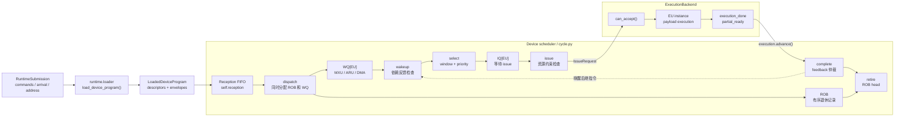

# Device Scheduler 架构与流程

本文说明当前 `cycle_event` TISA device scheduler 的模块边界、队列结构和逐周期数据流。
它对应论文中 `Reception Buffer -> WQ -> IQ -> Exec` 的语义路径，并补充项目中用于容量
管理和顺序退休的 ROB、Fu、tile window 以及 runtime 地址依赖。

论文 Semantic Conflict Detection、per-EU `Fu` 和跨 EU 依赖的对齐说明见
[Scheduler 与论文对齐](scheduler-paper-alignment.md)。

详细的配置字段、命令行示例、stall 统计口径和手算时间线见
[周期仿真运行指南](../running/device-scheduler.md)。

## 1. 模块边界



三层职责分别是：

| 层 | 输入 | 主要职责 |
| --- | --- | --- |
| Runtime / loader | `RuntimeSubmission`、最终 TISA、`MemoryPlan` | 绑定地址、动态参数、descriptor arrival 和 completion token，生成 `LoadedDeviceProgram` |
| Device scheduler | `LoadedDeviceProgram`、policy、`MachineConfig`、backend feedback | 管理 Reception/WQ/IQ/ROB，检查依赖，执行 select/issue/completion/retire 仲裁 |
| ExecutionBackend | payload handle、`IssueRequest` | 管理 EU instance、payload timing、busy/II，并返回 physical completion 或 partial-ready |

`DeviceSimulator` 负责把 loader、scheduler 和 backend 连接起来；scheduler 不直接读取
`BackendArtifact.execution_graph` 或 payload primitive。整体编译链和公共契约见
[总体架构](architecture.md) 与 [TISA 论文语义对齐](tisa-alignment.md)。

## 2. 与论文 Figure 4 的对应

论文图中的编号可以映射为：

```text
Reception Buffer --(1)--> WQ[unit]
WQ[unit]         --(2)--> IQ[unit]
IQ[unit]         --(3)--> Exec[unit]
Exec[unit]       --(4)--> wakeup / dependency feedback
```

当前项目中的对应关系是：

| 论文概念 | 当前实现 | 说明 |
| --- | --- | --- |
| Reception Buffer | `self.reception` | 接收已到达 descriptor 的 FIFO |
| `WQTensor` / `WQVector` / `WQDMA` | `self.wq[resource]` | 按 EU 类别划分的等待队列 |
| `IQTensor` / `IQVector` / `IQDMA` | `self.iq[resource]` | 已经 ready、等待 issue 的队列 |
| `Exec[unit]` | `ExecutionBackend` 的 EU instance | 负责 payload 内部执行和物理完成 |
| 反馈 4 | `ExecutionFeedback` | `execution_done` 或 `partial_ready` |

项目额外维护：

- `ROB`：保存已经 dispatch、尚未 retire 的 TISA 指令，按 descriptor submission order 退休；
- `Fu`：保存已经 issue 的 TISA 身份，容量按 operand entry 计算；
- `tile window`：限制同时活跃的 tile 数；
- address/memory scoreboard：限制物理地址 alias 和 bank/port 冲突。

论文公开的是 scheduler 的语义结构；这些附加结构及其容量、延迟和带宽属于当前项目的
cycle-level 建模选择。

## 3. `RuntimeSubmission`、`loaded` 和 `execution` 的关系

`RuntimeSubmission` 不会直接传给 `_CycleScheduler`。真实调用链是：

```text
RuntimeSubmission
        |
        v
runtime.loader.load_device_program()
        |
        v
LoadedDeviceProgram
        |
        +-- descriptors: BoundTISADescriptor
        |      TISA instruction、operand、UnitMap、依赖、completion token
        |
        +-- envelopes: DescriptorEnvelope
               arrival_cycle、chunk、queue、descriptor order
```

在 `DeviceSimulator._prepare()` 中，loader 先生成 `LoadedDeviceProgram`，再创建
`ExecutionBackend`；`DeviceSimulator.run(model="cycle")` 将二者交给
`schedule_loaded_cycle_program()`。

因此：

- `loaded` 是 scheduler 的设备可见输入，包含 descriptor 和到达 envelope；
- `execution` 是 scheduler 外部的执行后端，拥有 payload 和 EU 物理资源状态；
- scheduler 通过 `IssueRequest` 请求执行，通过 `ExecutionFeedback` 接收完成信息。

## 4. 指令生命周期：ROB 不是 Reception Buffer

当前项目的准确数据流是：

```text
Runtime arrival
      |
      v
Reception FIFO
      |
      | receive_width / instruction_queue_depth
      v
dispatch
      |
      +--------------------> ROB allocation
      |
      +--------------------> WQ[resource] enqueue
                                      |
                                      v
                               wakeup / select
                                      |
                                      v
                                  IQ[resource]
                                      |
                                      v
                                     issue
                                      |
                                      v
                              ExecutionBackend
                                      |
                                      v
                             execution_done/partial_ready
                                      |
                              complete + wakeup
                                      |
                                      v
                              ROB head -> retire
```

这里 `dispatch` 是一个阶段，而不是两个连续阶段：代码会从 Reception FIFO 弹出一条指令，
然后同时执行：

```python
self.rob.append(tid)
self.wq[resource].append(tid)
```

因此不能理解成：

```text
Reception FIFO -> ROB -> WQ
```

而应理解成：

```text
Reception FIFO -> dispatch -> ROB + WQ
```

二者职责不同：

| 结构 | 解决的问题 | 释放时机 |
| --- | --- | --- |
| Reception FIFO | descriptor 已到达但还没有 dispatch | dispatch 时释放 |
| WQ | 指令等待依赖、等待被 select | select 时释放 |
| IQ | 指令已经 ready，等待 issue | issue 时释放 |
| ROB | 指令是否仍在设备内，以及退休顺序 | 按队首完成后 retire |

所以 scheduler 允许年轻指令先执行或先完成，但仍要求按照 ROB 顺序退休：

```text
younger issue/complete
        ↓
older complete
        ↓
ROB head retire
        ↓
younger retire
```

## 5. 逐周期流程

`cycle.py` 每个 cycle 使用固定顺序：

```text
retire → complete → wakeup → issue → select → dispatch → receive
```

这是逆向评估流水线，目的是让同一周期早期阶段释放的容量可以供后续阶段使用，同时
保持 receive、select、issue 之间存在寄存边界。

### 5.1 Retire

只检查 ROB 队首：

```text
ROB head.completed + retire_latency <= now
```

年轻指令即使已经 complete，也不能绕过老指令退休。

### 5.2 Complete

调用：

```python
execution.advance(now)
```

backend 的 physical done 先进入 scheduler 的 pending feedback；之后经过
`completion_latency` 和 `completion_width` 仲裁，才会成为 TISA `complete`。

成为 complete 后，scheduler 才会：

- 释放 Fu entry；
- 减少对应 tile 的剩余指令数；
- 必要时释放 tile window；
- 允许依赖该指令的后继执行 wakeup。

`partial_ready` 是独立 sideband，不占用完整 completion 总线，可提前唤醒指定依赖。

### 5.3 Wakeup

指令必须满足所有依赖。其最早 ready 时间可以概括为：

```text
ready(i) = max(
    dispatch(i) + dispatch_latency,
    dependency_feedback(j) + wakeup_latency
)
```

普通依赖使用 producer 的 TISA complete；`payload_ready:<task>` 使用 backend 返回的
partial-ready feedback。

### 5.4 Select

动态策略只在每个 EU WQ 的有限窗口内寻找候选：

```python
queue[:dependency_window]
```

候选必须已经 wakeup，然后按照 priority 排序。默认是 `oldest_first`；也可以使用
descriptor 的 `compiler_hint`，或者使用完整依赖图计算的 `oracle_critical_path`。

Select 阶段检查：

- address scoreboard；
- IQ 容量；
- select width。

通过后执行：

```text
WQ[resource] -> IQ[resource]
```

### 5.5 Issue

动态策略不会要求候选必须是全局 program-order 的下一条指令。它只要求候选已经在 IQ
中并经过 `select_latency`，然后检查：

- 全局和 EU 类型的 issue width；
- `max_inflight_tiles`；
- Fu operand capacity；
- 地址冲突；
- memory bank/port 冲突；
- `ExecutionBackend.can_accept()`。

全部通过后，scheduler 调用：

```python
execution.issue(IssueRequest(descriptor, now))
```

## 6. Dynamic 与 Static 的分界

两种策略共享同一份最终 target TISA、payload 和 MemoryPlan：

```text
同一份 TISA instruction stream
       |
       +--> static_pipeline：按全局静态顺序推进
       |
       +--> dynamic_ready_queue：在已到达、ready、可见窗口内乱序选择
```

Dynamic 不消费 `StaticControlProgram`，只使用：

- 已经 receive 的 descriptor；
- 显式 TISA dependency；
- runtime physical alias dependency；
- WQ/IQ/ROB/Fu 等容量；
- ExecutionBackend feedback。

因此 scheduler 不会查看尚未到达的未来 descriptor 来做在线决策。完整图 critical path
只用于离线 oracle 对照，不能当作真实在线硬件信息。

## 7. 当前建模边界

当前结果应标记为：

```text
TISA instruction-level analytical scheduling baseline
```

原因包括：

- WQ/IQ/Fu 容量和各阶段控制 latency 是项目显式参数；
- scheduler 的控制开销尚未完成硬件校准；
- `AnalyticalExecutionBackend` 提供 payload timing 和物理 EU busy/II；
- 当前 analytical backend 尚未利用 `pipeline_depth` 实现同一 EU instance 上的多条 TISA 重叠；
- memory bank scoreboard 是保守的 payload 级结构冲突模型，不是逐 transaction 的 DRAM/SRAM 时序。

运行参数和统计解释见 [周期仿真运行指南](../running/device-scheduler.md)，后续校准说明见
[RTL 校准](../analysis/rtl-calibration.md)。

## 8. 代码索引

| 代码位置 | 作用 |
| --- | --- |
| `simulator/device.py` | 连接 loader、scheduler 和 ExecutionBackend |
| `runtime/loader.py` | 生成 `LoadedDeviceProgram` 和 runtime alias dependency |
| `simulator/cycle.py:300` | retire / complete / wakeup |
| `simulator/cycle.py:393` | address scoreboard |
| `simulator/cycle.py:414` | issue |
| `simulator/cycle.py:514` | select |
| `simulator/cycle.py:557` | dispatch |
| `simulator/cycle.py:580` | receive |
| `simulator/cycle.py:646` | 逐周期主循环 |
| `execution/analytical.py` | payload timing、EU instance 和 completion feedback |
