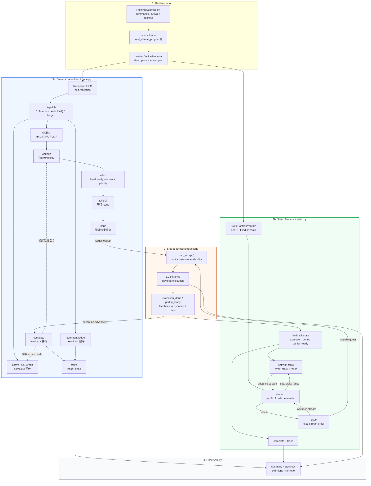

# Device Scheduler 架构与流程

本文说明当前 `cycle_event` TISA device scheduler 的模块边界、队列结构和执行数据流。
文档同时描述两条 scheduler 路径：

- Dynamic 沿用论文 Figure 4 的 `Reception Buffer -> WQ -> IQ -> Exec` 语义路径；
- Static Streams 使用编译器生成的 per-EU 固定流和 `set/wait/fence` 同步。

两条路径共享最终 target TISA、payload、MemoryPlan、依赖语义和 ExecutionBackend。
Dynamic 路径补充项目中的 ROB、Fu、tile window 和 runtime 地址依赖容量模型。

论文 Semantic Conflict Detection、per-EU `Fu` 和跨 EU 依赖的对齐说明见
[Scheduler 与论文对齐](scheduler-paper-alignment.md)。

详细的配置字段、命令行示例、stall 统计口径和手算时间线见
[周期仿真运行指南](../running/device-scheduler.md)。

## 1. 模块边界



各模块职责如下：

| 层 | 输入 | 主要职责 |
| --- | --- | --- |
| Runtime / loader | `RuntimeSubmission`、最终 TISA、`MemoryPlan` | 绑定地址、动态参数、descriptor arrival 和 completion token，生成 `LoadedDeviceProgram` |
| Static-control compiler | `BackendArtifact`、`MachineConfig` | 生成资源约束的 per-EU 指令流和 `set/wait/fence` 控制 |
| Device scheduler | `LoadedDeviceProgram`、policy、`MachineConfig`、backend feedback | Dynamic 管理 Reception/WQ/IQ/ROB，Static Streams 管理固定流 head 和事件同步 |
| ExecutionBackend | payload handle、`IssueRequest` | 管理 EU instance、payload timing、busy/II，并返回 physical completion 或 partial-ready |

`DeviceSimulator` 负责连接 loader、scheduler 和 backend。scheduler 读取
`LoadedDeviceProgram`，ExecutionBackend 持有 execution graph 和 payload primitive。整体编译链和公共契约见
[总体架构](architecture.md) 与 [TISA 论文语义对齐](tisa-alignment.md)。

## 2. 与论文 Figure 4 的对应

论文图中的编号可以映射为：

```text
Reception Buffer --(1)--> WQ[unit]
WQ[unit]         --(2)--> IQ[unit]
IQ[unit]         --(3)--> Exec[unit]
Exec[unit]       --(4)--> wakeup / dependency feedback
```

当前项目中的对应关系是：

| 论文概念 | 当前实现 | 说明 |
| --- | --- | --- |
| Reception Buffer | `self.reception` | 接收已到达 descriptor 的 FIFO |
| `WQTensor` / `WQVector` / `WQDMA` | `self.wq[resource]` | 按 EU 类别划分的等待队列 |
| `IQTensor` / `IQVector` / `IQDMA` | `self.iq[resource]` | 已经 ready、等待 issue 的队列 |
| `Exec[unit]` | `ExecutionBackend` 的 EU instance | 负责 payload 内部执行和物理完成 |
| 反馈 4 | `ExecutionFeedback` + completion-tag broadcast | `execution_done` 或 condition-specific `partial_ready`；全部 WQ snoop tag |

项目额外维护：

- active ROB credit：统计已经 dispatch、等待 complete 的 TISA 指令，complete 时回收；
- retirement ledger：保存已经 dispatch、等待 retire 的 TISA 指令，按 descriptor submission
  order 退休；
- `Fu`：保存已经 issue 的 TISA 身份，通过 descriptor 读取绑定 scope/range/access/OpType；
  容量按 operand entry 计算；
- `tile window`：限制同时活跃的 tile 数；
- address/memory scoreboard：限制物理地址 alias 和 bank/port 冲突。

论文公开的是 scheduler 的语义结构；这些附加结构及其容量、延迟和带宽属于当前项目的
cycle-level 建模选择。

## 3. `RuntimeSubmission`、`loaded` 和 `execution` 的关系

`runtime.loader` 将 `RuntimeSubmission` 转换为 `LoadedDeviceProgram`，`_CycleScheduler`
接收转换后的设备可见描述：

```text
RuntimeSubmission
        |
        v
runtime.loader.load_device_program()
        |
        v
LoadedDeviceProgram
        |
        +-- descriptors: BoundTISADescriptor
        |      TISA instruction、operand、UnitMap、依赖、completion token
        |
        +-- envelopes: DescriptorEnvelope
               arrival_cycle、chunk、queue、descriptor order
```

在 `DeviceSimulator._prepare()` 中，loader 先生成 `LoadedDeviceProgram`，再创建
`ExecutionBackend`；`DeviceSimulator.run(model="cycle")` 将二者交给
`schedule_loaded_cycle_program()`。

因此：

- `loaded` 是 scheduler 的设备可见输入，包含 descriptor 和到达 envelope；
- `execution` 是 scheduler 外部的执行后端，拥有 payload 和 EU 物理资源状态；
- scheduler 通过 `IssueRequest` 请求执行，通过 `ExecutionFeedback` 接收完成信息。

## 4. Static Streams 路径（论文 Static 对应）

`static_streams` 对应论文中的 Static strategy。编译器在最终 target TISA、payload 和
`MemoryPlan` 确定后完成资源约束排程，将每个 logical EU stream 的执行顺序编码为固定流，
并使用 `set/wait/fence` 表达跨阶段依赖和 buffer reuse 同步。

论文与项目实现按以下边界对应：

| 层次 | 定义 |
| --- | --- |
| 论文 Static 语义 | 编译期重排、多阶段流水 overlap、fence-based dependency management |
| 项目控制表示 | `StaticInstructionStream` 和 `issue/set/wait/fence` command |
| 项目事件身份 | invocation scope、generation、source TISA 和 condition |
| 项目控制时序 | control/wait/fence width 与 latency 参数 |
| 项目 instance 语义 | logical stream instance 用于编译期分流和 trace identity；ExecutionBackend 按 resource 分配可用 physical instance |

per-EU 固定流和 fence 同步承载论文 Static 的公开语义。command 编码、event generation、
控制带宽/延迟及 logical-to-physical instance 映射属于项目的 cycle-level 表达，后续通过
论文补充材料或 RTL 数据校准。

```text
BackendArtifact + MachineConfig
        |
        v
resource-constrained list scheduling
        |
        v
StaticControlProgram
  per-EU StaticInstructionStream
        |
        v
stream head: wait/fence -> issue -> set
        |
        v
ExecutionBackend -> execution_done / partial_ready
```

### 4.1 编译期生成

`static_scheduler.py` 读取共享 workload 的 TISA dependency、EU 数量和 payload 声明时长，
为每条指令选择 `(resource, logical instance)` stream 和估计开始/结束时间。每个
`StaticInstructionStream` 保存该 logical stream 的固定 command 顺序；每条 `issue`
command 引用共享 workload 中的一条 target TISA 指令。

编译器为每条跨指令依赖建立 `StaticEvent`：

- `wait` 表达 true dependency 的 ready condition；
- `fence` 表达 allocation/buffer reuse 的释放 condition；
- `set` 在 source 的匹配 feedback 到达后发布 event；
- event 使用 invocation scope、generation 和 condition 标识数据版本。

Static control 的 estimated timing 用于排程和观测，运行期仍以 ExecutionBackend 的实际
接受条件和 feedback 为准。stream head 按固定顺序前进，控制 command 的延迟由
`control_width`、`control_latency`、`wait_latency` 和 `fence_latency` 参数建模。

### 4.2 运行期执行

Static Streams 直接从 `LoadedDeviceProgram` 和 `StaticControlProgram` 建立执行状态。
每个 stream 每次处理自己的 head command：

1. `issue` 等待 descriptor arrival，并向 ExecutionBackend 请求目标 resource 的执行；
2. `wait` 读取 event state，event ready 后推进 stream；
3. `fence` 读取 allocation release event，buffer slot 可安全复用后推进 stream；
4. `set` 等待 source 的 `execution_done` 或指定 `partial_ready`，然后发布 event。

各 stream 独立推进，因此不同 EU、不同 iteration 和不同 pipeline stage 可以按编译期安排
形成 overlap。ExecutionBackend 统一负责 payload、EU busy/II、physical completion 和
partial-ready feedback；Static executor 负责 stream head、event state 和 control trace。

### 4.3 Static correctness contract

Static Streams 的正确性由共享 dependency graph、静态 control validation 和 runtime alias
准入验证共同定义：

- 每条 TISA dependency 对应一个 typed `StaticEvent`；
- consumer issue 前存在对应的 `wait` 或 `fence`；
- producer feedback 到达后执行对应的 `set`；
- runtime alias 绑定经过 required condition 的 happens-before 证明；
- 执行结束时逐条验证 bound dependency 的 required condition ready cycle 和 consumer issue。

condition-aware happens-before graph 使用 static command 顺序和 typed event 建立因果边：

- `physical_range_released`、`allocation_released` 和普通完成条件从 source full completion 开始；
- `payload_ready:<task>` 从 source 的指定 partial feedback 开始；
- `set -> wait/fence -> target issue` 和 stream 内 command 顺序传播 happens-before 关系。

因此 full-completion alias 由 full completion 路径证明，partial-ready 路径只证明对应的
partial condition。这套 contract 将编译期固定流、运行期地址绑定和执行反馈连接为一个
完整的 correctness 路径。

## 5. Static Streams 与 Dynamic 对照

| 维度 | Static Streams（论文 Static） | Dynamic ready queue |
| --- | --- | --- |
| 决策位置 | 编译期资源约束 list scheduling | 运行期 scheduler cycle |
| 输入 | target TISA、payload、MemoryPlan、MachineConfig | Loaded descriptor、runtime address、backend feedback |
| 控制表示 | per-EU 固定 stream + `set/wait/fence` | 单一 Reception FIFO + per-EU WQ/IQ + dependency state |
| 候选选择 | stream head 的固定顺序 | 固定大小 ready window 内的 ready candidate |
| 依赖同步 | 静态 event、wait、fence、set | completion/partial-ready tag 与 pending dependency mask |
| 资源判断 | 编译期 EU instance 排程，运行期 `can_accept()` 校验 | 运行期 Fu、tile、地址、bank/port 和 `can_accept()` 校验 |
| 地址变化 | runtime alias 通过 condition-aware 顺序准入 | runtime physical alias 进入 address scoreboard |
| 执行后端 | 共享 ExecutionBackend | 共享 ExecutionBackend |

Static Streams 为论文 Static 提供编译期固定流语义；Dynamic ready queue 为同一 TISA workload
提供运行期 ready-window 选择语义。两条路径共享 payload timing、EU instance 和 completion
feedback，因此性能差异直接反映控制位置、可见窗口和容量模型的差异。

## 6. Dynamic 指令生命周期：ROB 与 Reception Buffer

Dynamic 路径使用一个 Reception FIFO 保持 descriptor 接收顺序。FIFO head 在 dispatch
阶段同时进入目标 WQ、active ROB credit 集合和 ordered retirement ledger：

```text
Runtime arrival
      |
      v
single Reception FIFO
      |
      v
dispatch
      +------> active ROB credit
      +------> ordered retirement ledger
      +------> WQ[resource] -> wakeup/select -> IQ[resource] -> issue
                                                           |
                                                           v
                                                   ExecutionBackend
                                                           |
                                                           v
                                                        complete
                                      +--------------------+------------------+
                                      |                    |                  |
                                      v                    v                  v
                           release active credit    dependency wakeup    ledger retire
```

dispatch、complete 和 retire 分别执行以下状态转换：

```python
# dispatch
self.rob_active.add(tid)
self.rob.append(tid)
self.wq[resource].append(tid)

# complete
self.rob_active.remove(tid)

# retire
tid = self.rob.popleft()  # completed ledger head
```

| 结构 | 状态含义 | 容量或推进规则 |
| --- | --- | --- |
| Reception FIFO | 已到达且等待 dispatch 的 descriptor | FIFO head dispatch 后释放 slot |
| WQ | 等待依赖 ready 和 select 的指令 | select 后释放 WQ slot |
| IQ | ready 且等待 issue 的指令 | issue 后释放 IQ slot |
| Active ROB credit | 已 dispatch 且等待 complete 的指令 | complete 回收 credit，容量为 `rob_entries` |
| Retirement ledger | 已 dispatch 且等待有序 retire 的指令 | completed ledger head 按 `retire_width/latency` 推进 |

active credit 控制 scheduler 同时跟踪的未完成指令数量，retirement ledger 保留 descriptor
submission order。年轻指令可以先 complete 并回收 active credit，其 retirement record
持续等待老指令完成，最终按 ledger 顺序退休。

全局 ROB credit 和 ordered retirement ledger 属于项目的 cycle-level 容量与观测模型。
论文 Figure 4 的公开路径由单一 Reception Buffer、per-EU WQ/IQ、Exec 和 feedback 构成。

## 7. Dynamic 逐周期流程

`cycle.py` 每个 cycle 使用固定顺序：

```text
retire → complete → wakeup → issue → select → dispatch → receive
```

这是逆向评估流水线，目的是让同一周期早期阶段释放的容量可以供后续阶段使用，同时
保持 receive、select、issue 之间存在寄存边界。

### 7.1 Retire

Retire 每周期检查 ordered retirement ledger 的队首：

```text
ledger head.completed + retire_latency <= now
```

完成条件满足后，ledger head 按 `retire_width` 退休。年轻指令保留 retirement record，
直到前面的 record 依次退休。

### 7.2 Complete

调用：

```python
execution.advance(now)
```

backend 的 physical done 先进入 scheduler 的 pending feedback；之后经过
`completion_latency` 和 `completion_width` 仲裁，才会成为 TISA `complete`。

成为 complete 后，scheduler 才会：

- 释放 Fu entry；
- 回收 active ROB credit；
- 减少对应 tile 的剩余指令数；
- 必要时释放 tile window；
- 广播 `(invocation, source TISA, condition)` completion tag；
- 清除所有 per-EU WQ 中匹配的 pending dependency bit。

`partial_ready` 使用独立 sideband，可提前唤醒指定依赖；完整 completion 使用 completion 总线。

### 7.3 Wakeup

每条已接收指令保存 pending dependency mask。所有 WQ snoop complete/partial-ready tag；
只有全部 pending bit 清零才可 wakeup。已经发布的 tag 保留 ready cycle，以支持 producer
先完成、consumer 后到达。其最早 ready 时间可以概括为：

```text
ready(i) = max(
    dispatch(i) + dispatch_latency,
    dependency_feedback(j) + wakeup_latency
)
```

普通依赖使用 producer 的 TISA complete；`payload_ready:<task>` 使用 backend 返回的
partial-ready feedback。

### 7.4 Select

Dynamic 在每个 EU WQ 的固定大小 ready window 内寻找候选：

```python
queue[:dependency_window]
```

候选全部显式依赖 ready 后，对目标 resource 的本地 `Fu[resource]` 执行 SemanticConflict：
physical memory/allocation 确定 alias domain，地址区间与 access type 确定 RAW/WAR/WAW。
write-bearing OpType 使用保守冲突规则。候选通过检查后进入 IQ；issue 前再次验证，
覆盖 select→issue 间的 Fu 状态变化。

候选必须已经 wakeup，然后按照 priority 排序。默认是 `oldest_first`；也可以使用
descriptor 的 `compiler_hint`，或者使用完整依赖图计算的 `oracle_critical_path`。

Select 阶段检查：

- address scoreboard；
- IQ 容量；
- select width。

通过后执行：

```text
WQ[resource] -> IQ[resource]
```

### 7.5 Issue

Dynamic issue eligibility 由 IQ residence、`select_latency` 和运行期资源状态确定。
候选经过以下检查：

- 全局和 EU 类型的 issue width；
- `max_inflight_tiles`；
- Fu operand capacity；
- 地址冲突；
- memory bank/port 冲突；
- `ExecutionBackend.can_accept()`。

全部通过后，scheduler 调用：

```python
execution.issue(IssueRequest(descriptor, now))
```

## 8. Dynamic 在线决策边界

Dynamic ready queue 的在线可见状态由以下信息构成：

- 已经进入单一 Reception FIFO 的 descriptor；
- 每个 EU WQ 的固定大小 ready window；
- 显式 TISA dependency 和 runtime physical alias dependency；
- WQ/IQ、active ROB credit、Fu 和 tile window 容量；
- ExecutionBackend 的 resource availability 和 completion feedback。

每轮 candidate set 严格来自已经到达且位于固定 ready window 内的 descriptor。默认
`oldest_first`、`compiler_hint` 和其他在线 priority 都在同一个 candidate set 内排序。
完整图 critical path 作为离线 oracle 生成对照结果，并在 metrics 中标记 oracle 信息来源。

`StaticControlProgram` 由 Static Streams executor 执行。`static_pipeline` 保留全局固定顺序的
兼容/reference 行为；论文 Static 的主要映射策略是 `static_streams`。

## 9. 当前建模边界

当前结果统一标记为：

```text
TISA instruction-level analytical scheduling baseline
```

模型边界如下：

- WQ/IQ/Fu 容量和各阶段 control latency 使用项目显式参数；
- completion-tag 全 WQ 广播实现论文的 dependent notification 语义；
- SemanticConflict 覆盖 scope/allocation/range/access 核心规则，write-bearing OpType 使用保守规则；
- scheduler control timing 的 calibration status 为 `uncalibrated`；
- `AnalyticalExecutionBackend` 提供 payload timing、物理 EU busy 和 initiation interval；
- same-instance TISA 接受采用当前 ExecutionBackend 的 run-to-completion 规则；
- memory bank scoreboard 使用 payload 级 bank/port reservation 粒度；
- active ROB credit 和 ordered retirement ledger 属于项目扩展。

运行参数和统计解释见 [周期仿真运行指南](../running/device-scheduler.md)，后续校准说明见
[RTL 校准](../analysis/rtl-calibration.md)。

## 10. 代码索引

| 代码位置 | 作用 |
| --- | --- |
| `simulator/device.py` | 连接 loader、scheduler 和 ExecutionBackend |
| `runtime/loader.py` | 生成 `LoadedDeviceProgram` 和 runtime alias dependency |
| `compiler/static_scheduler.py` | 生成 per-EU fixed streams 和 typed static events |
| `ir/static.py` | 定义 StaticControlProgram、stream、command 和 validation contract |
| `scheduler/static.py` | 执行 Static Streams、验证 condition-aware happens-before |
| `simulator/cycle.py` | Dynamic receive/dispatch/select/issue/complete/retire 主循环 |
| `simulator/cycle.py` | active ROB credit、retirement ledger、completion broadcast 和 per-unit Fu |
| `scheduler/event.py` | Dynamic event-reference backend 和 completion-time ROB credit 回收 |
| `scheduler/semantics.py` | TileMem alias/range/access conflict rules |
| `execution/analytical.py` | payload timing、EU instance 和 completion feedback |
