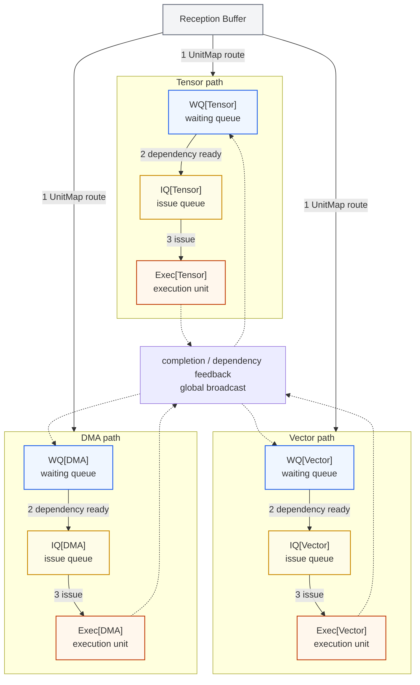
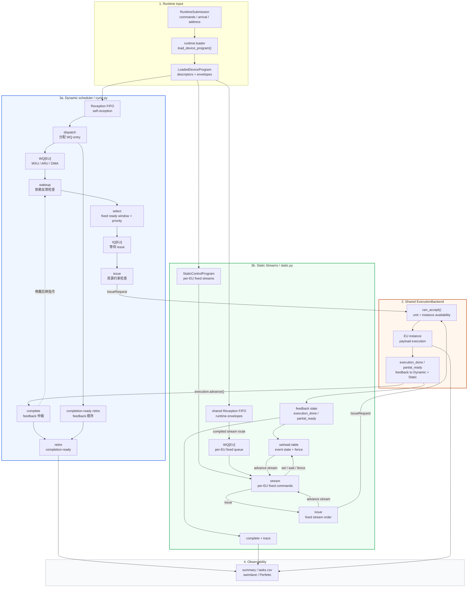
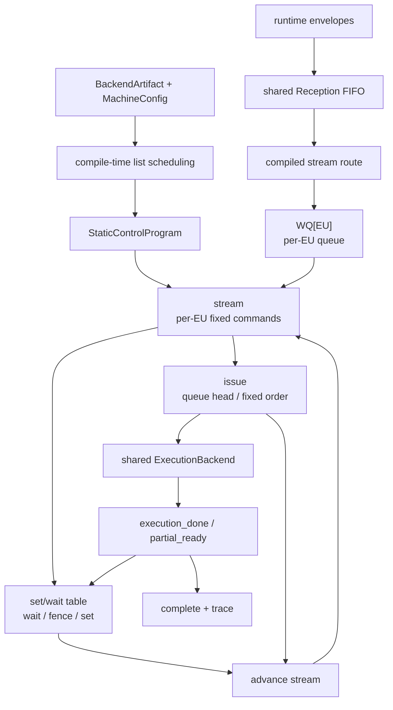
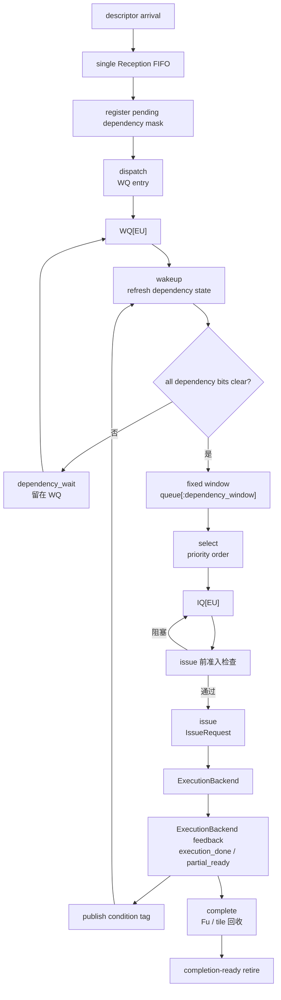

# Device Scheduler 架构与流程

本文说明当前 `cycle_event` TISA device scheduler 的模块边界、队列结构和执行数据流。
文档同时描述两条 scheduler 路径：

- Dynamic 沿用论文 Figure 4 的 `Reception Buffer -> WQ -> IQ -> Exec` 语义路径；
- Static Streams 使用同一个 `Reception Buffer`、编译器生成的 per-EU 固定流和 `set/wait/fence` 同步。

两条路径共享最终 target TISA、payload、MemoryPlan、依赖语义和 ExecutionBackend。
Dynamic 路径使用 Fu、tile window 和 runtime 地址依赖容量模型，完成反馈直接驱动
completion-ready retire。

论文 Semantic Conflict Detection、per-EU `Fu` 和跨 EU 依赖的对齐说明见
[Scheduler 与论文对齐](scheduler-paper-alignment.md)。

详细的配置字段、命令行示例、stall 统计口径和手算时间线见
[周期仿真运行指南](../running/device-scheduler.md)。

## 1. 整体调度硬件架构（论文 Figure 4 对应）

当前调度器沿用论文 Figure 4 的 per-unit semantic scheduling 结构。Reception Buffer
统一接收已经到达的 TISA descriptor；每类 execution unit 拥有独立的 waiting queue、issue
queue 和 execution unit。队列按 UnitMap 分流，依赖完成通过 feedback 通知后继队列。



图中三条 lane 表示 Tensor、Vector 和 DMA 的并行调度路径。虚线先汇入全局 feedback
broadcast，再广播到所有 WQ；实际 consumer 由 typed dependency 决定，不限定为某一组
Exec 到另一组 WQ 的固定连接。

图中编号对应论文的调度路径：

1. Reception Buffer 接收 descriptor，并按 `UnitMap` 分发到对应的 per-unit WQ。
2. WQ 中依赖已经满足的候选进入对应 IQ。
3. IQ 向可用的 Exec unit 发出 issue 请求。
4. Exec 完成后将 completion 或 partial-ready feedback 广播到所有 WQ，由匹配的 dependency
   entry 接收。

WQ、IQ 和 Exec 按 execution unit 类别独立维护；跨 EU 依赖通过 feedback 在队列之间传播。
Fu、tile window 和 address scoreboard 属于 Dynamic 的周期级容量与安全检查，具体策略流程
见后续 Static Streams 和 Dynamic ready queue 章节。

## 2. 模块边界



各模块职责如下：

| 层 | 输入 | 主要职责 |
| --- | --- | --- |
| Runtime / loader | `RuntimeSubmission`、最终 TISA、`MemoryPlan` | 绑定地址、动态参数、descriptor arrival 和 completion token，生成 `LoadedDeviceProgram` |
| Static-control compiler | `BackendArtifact`、`MachineConfig` | 生成资源约束的 per-EU 指令流和 `set/wait/fence` 控制 |
| Device scheduler | `LoadedDeviceProgram`、policy、`MachineConfig`、backend feedback | Dynamic 管理 Reception/WQ/IQ，Static Streams 管理共享 Reception、per-EU WQ、固定流 command 和事件同步 |
| ExecutionBackend | payload handle、`IssueRequest` | 管理 EU instance、payload timing、busy/II，并返回 physical completion 或 partial-ready |

`DeviceSimulator` 负责连接 loader、scheduler 和 backend。scheduler 读取
`LoadedDeviceProgram`，ExecutionBackend 持有 execution graph 和 payload primitive。整体编译链和公共契约见
[总体架构](architecture.md) 与 [TISA 论文语义对齐](tisa-alignment.md)。

## 3. Static Streams 策略

`static_streams` 对应论文 Static strategy。编译器根据最终 target TISA、payload、
`MemoryPlan` 和 `MachineConfig` 生成每个逻辑 EU 的固定 command stream；运行期 descriptor
先进入共享 Reception FIFO，再按编译分配路由到对应 EU 的 WQ。每个 EU 每周期从自己的 WQ
取一条队首指令，set/wait table 管理跨 stream 依赖和 buffer reuse。

### 3.1 流程



流程顺序：

1. 编译器为每条 target TISA 指令选择 `(resource, logical instance)`，估计开始和结束时间。
2. `StaticControlProgram` 保存 per-EU stream；stream command 包含 `issue`、`wait`、
   `fence` 和 `set`。
3. Runtime envelope 以 Dynamic 相同的 receive width 进入共享 Reception FIFO。
4. Static dispatch 按每个 stream 的下一条编译指令从 Reception 取数，每个 EU 每周期向
   自己的 WQ 放入一条 descriptor。
5. EU 只检查 WQ 队首和当前 stream command。`issue` 携带编译期选择的 EU instance 向共享
   ExecutionBackend 请求执行，物理 payload 在该 instance 上运行；
   `wait` 等待依赖 event，`fence` 等待 allocation release，`set` 在 source feedback
   到达后按 consumer 数量发布 token。
6. command 完成后 stream 前进。各 EU stream 独立推进，形成编译期安排的流水 overlap。

### 3.2 依赖与事件

每条跨指令依赖生成一个 `StaticEvent`，事件身份包含 invocation、generation、source TISA
和 condition：

| command | 作用 |
| --- | --- |
| `wait` | 等待 producer 的 ready condition 并消费 set_wait token |
| `fence` | 等待 physical range 或 allocation release，并消费对应 token |
| `set` | 在 producer 的 `execution_done` 或指定 `partial_ready` 后按消费者数量发布 token |
| `issue` | 在当前 stream 顺序和前置 event 满足后请求执行 |

运行期以 ExecutionBackend 的实际 `can_accept()` 和 feedback 为准；control、wait、fence
的带宽和延迟由配置参数建模。

### 3.3 正确性

- 每条 TISA dependency 对应一个 typed `StaticEvent`。
- consumer issue 前存在对应 `wait` 或 `fence`，producer feedback 到达后执行 `set`。
- runtime alias 绑定经过 required condition 的 happens-before 证明。
- full completion 使用 producer full completion；`payload_ready:<task>` 使用指定 partial
  feedback。
- 执行结束逐条验证 bound dependency 的 ready cycle 早于 consumer issue cycle。

## 4. Dynamic ready queue 策略

Dynamic 在运行期处理已经到达的 descriptor。单一 Reception FIFO 保持接收顺序，per-EU WQ
保存等待中的指令，固定大小 window 限制每轮可选候选，IQ 保存已选中且等待 issue 的指令。

### 4.1 流程



Dynamic 每个 cycle 按以下顺序推进：

```text
retire -> complete -> wakeup -> issue -> select -> dispatch -> receive
```

`complete` 释放本周期可复用的 Fu 和 tile 容量，`wakeup` 消费完成反馈，`select` 将 ready
指令移入 IQ，`issue` 向 ExecutionBackend 提交请求，`dispatch` 将 Reception FIFO head 放入
WQ。完成反馈按照 completion-ready 顺序推进 retire。

### 4.2 依赖检查

Dynamic 依赖检查分成 wakeup 和 issue 前两个阶段：

#### 4.2.1 Wakeup：跨 EU 依赖

Wakeup 判断 descriptor 的显式 TISA dependency 是否已经满足，依赖可以跨越不同 EU，例
如 MXU producer 到 ARU consumer。检查点如下：

1. descriptor 在 receive 阶段注册 `(source completion token, condition)`，形成
   `pending_dependencies`。
2. producer 的 `execution_done` 或指定 `payload_ready:<task_id>` 生成 condition tag，并
   全局广播给 WQ。
3. WQ entry 按 source token 和 condition 匹配 tag，清除对应 pending bit；全部 bit 清零
   且满足 wakeup latency 后，指令进入 ready 状态。
4. producer 先完成时，ready cycle 保留在 scheduler state，后到达的 consumer 直接消费该
   状态。仍有 pending bit 的指令保持在 WQ，并记录 `dependency_wait`。

依赖 kind 包括 `RAW`、`WAR`、`WAW`、`STATE`、`ACCUMULATE`、`BUFFER_REUSE` 和
`CONTROL`；condition 描述 producer 的可消费时刻。

#### 4.2.2 Issue 前：当前 EU 的 Fu 检查

候选进入 IQ 后，scheduler 在目标 EU issue 前检查当前 `Fu[resource]` 中仍在执行的旧指令：

1. 比较 semantic scope、unit 和 operand role，确认两条指令可以并发。
2. 比较 operand 的 physical scope 和地址范围；重叠范围进入冲突判定。
3. 根据 access type 判断 RAW、WAR、WAW；write-bearing OpType 使用保守规则。
4. 出现 SemanticConflict 时，候选停留在 IQ，等待 Fu 状态变化。

Runtime address scoreboard 同时检查更早、尚未完成的 descriptor，使用相同的 physical
scope、地址范围和 access type 规则覆盖动态 alias。Fu 冲突和 address hazard 都通过后，
再执行 issue width、tile/Fu capacity、bank/port 和 `ExecutionBackend.can_accept()` 检查。

### 4.3 Fixed window 与 select

每个 EU 的候选集严格来自：

```python
queue[:dependency_window]
```

候选必须已经 wakeup。Dynamic 在该 window 内按 `oldest_first`、`compiler_hint` 或配置的
critical-path priority 排序，然后执行 select 检查：

- SemanticConflict；
- address scoreboard hazard；
- IQ 容量；
- select width。

通过后执行：

```text
WQ[resource] -> IQ[resource]
```

### 4.4 Complete、回收与 retire

`execution.advance(now)` 返回 physical done 或 partial-ready。完整完成经过
`completion_latency` 和 `completion_width` 仲裁后成为 TISA complete；complete 执行：

- 释放 Fu entry；
- 更新 tile remaining，必要时释放 tile window；
- 广播 source TISA 的 completion conditions；
- 清除 WQ 中匹配的 pending dependency bit。

Retire 记录 completion-ready 指令的实际完成顺序，Dynamic 允许年轻指令先完成并先 retire。

## 5. Static 与 Dynamic 对照

| 维度 | Static Streams（论文 Static） | Dynamic ready queue |
| --- | --- | --- |
| 决策位置 | 编译期资源约束 list scheduling | 运行期 scheduler cycle |
| 控制表示 | 共享 Reception FIFO + per-EU WQ + fixed stream + `set/wait/fence` | 单一 Reception FIFO + per-EU WQ/IQ |
| 候选选择 | stream command 固定顺序 | 固定 `queue[:dependency_window]` 内按 priority 选择 |
| 依赖同步 | StaticEvent、wait、fence、set | condition tag 与 pending dependency mask |
| 地址与资源 | 编译期 instance 排程，运行期 `can_accept()` 校验 | runtime scope/range/access、Fu、bank/port 和 `can_accept()` |
| 完成管理 | stream/event state | completion broadcast、Fu/tile 回收、completion-ready retire |
| 执行后端 | 共享 ExecutionBackend | 共享 ExecutionBackend |

两条策略使用同一 target TISA、operand region、payload timing、EU instance 和 completion
feedback。策略差异来自控制位置、候选可见范围和容量模型。

## 6. 共享契约与论文对齐

### 6.1 Runtime、loaded 与 execution

```text
RuntimeSubmission
        |
        v
runtime.loader.load_device_program()
        |
        v
LoadedDeviceProgram
        +-- descriptors: BoundTISADescriptor
        |      TISA、operand、UnitMap、依赖、completion token
        +-- envelopes: DescriptorEnvelope
               arrival_cycle、chunk、queue、descriptor order
```

`LoadedDeviceProgram` 是 scheduler 的设备可见输入；ExecutionBackend 持有 payload 和 EU
物理状态。scheduler 通过 `IssueRequest` 请求执行，通过 `ExecutionFeedback` 接收 physical
completion 和 partial-ready。

### 6.2 Figure 4 对应关系

| 论文概念 | 当前实现 | 作用 |
| --- | --- | --- |
| Reception Buffer | `self.reception` | Dynamic 与 Static 共用的 descriptor FIFO |
| `WQTensor` / `WQVector` / `WQDMA` | `self.wq[resource]` 或 Static `self.wq[stream]` | 按 EU 类型或逻辑 EU 保存等待指令 |
| `IQTensor` / `IQVector` / `IQDMA` | `self.iq[resource]` | 保存 ready、等待 issue 的指令 |
| `Exec[unit]` | ExecutionBackend EU instance | 执行 payload 并返回反馈 |
| 反馈 4 | completion-tag broadcast | 唤醒跨 EU 后继指令 |

项目在 Dynamic 论文路径上增加 tile window、Fu 和 address/memory scoreboard，用于建模容量、
别名和周期级资源约束。Static 使用编译 stream 和 set/wait/fence 的确定性控制。

## 7. 当前建模边界

当前结果统一标记为：

```text
TISA instruction-level analytical scheduling baseline
```

模型使用项目显式参数描述 WQ/IQ/Fu 容量、issue/select/completion/control latency、
completion width、memory bank/port 和 ExecutionBackend timing。`static_pipeline` 保留全局
固定顺序的兼容/reference 行为；论文 Static 的主要映射策略是 `static_streams`。

运行参数和统计解释见 [周期仿真运行指南](../running/device-scheduler.md)，后续校准说明见
[RTL 校准](../analysis/rtl-calibration.md)。

## 8. 代码索引

| 代码位置 | 作用 |
| --- | --- |
| `simulator/device.py` | 连接 loader、scheduler 和 ExecutionBackend |
| `runtime/loader.py` | 生成 `LoadedDeviceProgram` 和 runtime alias dependency |
| `compiler/static_scheduler.py` | 生成 per-EU fixed streams 和 typed static events |
| `ir/static.py` | 定义 StaticControlProgram、stream、command 和 validation contract |
| `scheduler/static.py` | 执行 Static Streams、验证 condition-aware happens-before |
| `simulator/cycle.py` | Dynamic receive/dispatch/select/issue/complete/retire 主循环 |
| `scheduler/event.py` | Dynamic event-reference backend 和 completion-time feedback 处理 |
| `scheduler/semantics.py` | TileMem alias/range/access conflict rules |
| `execution/analytical.py` | payload timing、EU instance 和 completion feedback |
